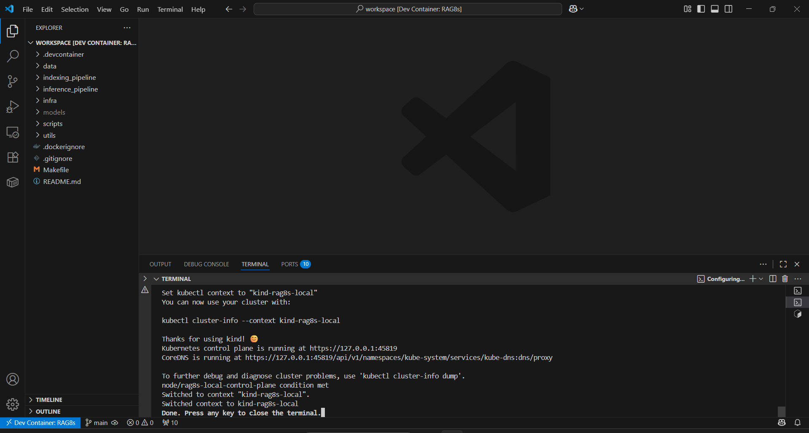

## indexing_pipeline/  (Indexing & Ingestion)

**Ingests raw sources, extracts structured content, produces chunked artifacts and embeddings, and populates graph/vector stores**

* **Parsing:** document ingestion with **PyMuPDF**, **pdfplumber**, **tesserocr/RapidOCR** (OCR), **faster-whisper** (audio), **BeautifulSoup/extractous** (HTML).  
* **Chunking & Preprocessing:** page-level + layout-aware segmentation, silence-based audio slicing, JSON flattening, deduplication, tag-structured HTML/Markdown chunking. 

<details>
  <summary> View chunk stratergies and chunk schema (Click the triangle)</summary>

#### **NVIDIA (June 2025)** : Page-level chunking is the baseline best https://developer.nvidia.com/blog/finding-the-best-chunking-strategy-for-accurate-ai-responses/

> “Page-level chunking is the overall winner: Our experiments clearly show that page-level chunking achieved the highest average accuracy (0.648) across all datasets and the lowest standard deviation (0.107), showing more consistent performance across different content types. Page-level chunking demonstrated superior overall performance when compared to both token-based chunking and section-level chunking.” 


```c
{
  "document_id": "doc-12345", // All: global document identifier (filename or UUID)
  "chunk_id": "chunk-0001", // All: unique chunk id (doc-scoped index or UUID)
  "chunk_type": "page", // pdf:page|page_subchunk, pptx:slides, txt:txt_subchunk, md:md_subchunk, jsonl:row_group, csv/html/wav:token_window, images:image
  "text": "Sample extracted text .", // text-bearing formats: extracted canonicalized text; wav/images may have ASR/OCR transcript or empty
  "token_count": 128, // txt,md,wav,html,csv,pdf,pptx,jsonl: tokenizer token count if computed
  "embedding": [0.12, -0.08, 0.44], // All: null before vectorization; numeric array after embedding
  "file_type": "application/pdf", // All: MIME type (e.g. application/pdf, audio/wav, text/plain, image/png, etc)
  "source_url": "s3://my-bucket/docs/report.pdf", // txt,md,jsonl,csv,html,wav: canonical URL (s3://... or https://...) of source object
  "page_number": 5, // pdf: integer page index (parser-defined base); null otherwise
  "slide_range": [1, 3], // pptx: [start_slide, end_slide] inclusive for chunk (replaces slide_range_start/slide_range_end)
  "row_range": [10, 20], // jsonl,csv: [start_row, end_row] inclusive for this chunk (replaces row_range_start/row_range_end)
  "token_range": [0, 127], // html,csv,jsonl: [token_start, token_end] token indices where window starts/ends (replaces token_start/token_end)
  "audio_range": ["00:00:05.000", "00:00:10.000"], // wav: [start_ts, end_ts] segment timestamps; null for non-audio
  "timestamp": "2025-09-14T12:34:56Z", // All: ISO8601 UTC when chunk created (e.g. 2025-09-14T12:34:56Z)
  "parser_version": "v1.2.3", // txt,md,jsonl,csv,html,pdf,pptx,wav: parser semantic version or tag
  "tags": ["financial", "confidential"], // pdf,pptx,images,html,general: producer tags for routing/classification
  "layout_tags": ["page"], // pdf,pptx,images,html: structural labels like ["page","slide","image","table"]
  "used_ocr": true, // pdf,images,pptx,md: whether OCR was applied
  "parse_chunk_duration_ms": 134, // All: integer ms spent parsing this chunk or null for wav
  "heading_path": ["Introduction", "Background"], // md: array representing nested heading hierarchy for the subchunk
  "headings": ["Introduction"], // md: flattened list of headings present inside chunk
  "line_range": [1, 20], // txt,md: [start_line, end_line] inclusive for subchunk (replaces line_range_start/line_range_end)
  "chunk_duration_ms": 5000, // for wav: audio chunk duration in ms since parsing is seperate
}

```

| Field                      | Description                                                                                                                                                                   | Indexed | Filterable |
| -------------------------- | ----------------------------------------------------------------------------------------------------------------------------------------------------------------------------- | :-----: | :--------: |
| document\_id               | Global document identifier (filename or UUID).                                                                                                                                |   Yes   |     Yes    |
| chunk\_id                  | Unique chunk identifier within document or global UUID.                                                                                                                       |   Yes   |     Yes    |
| chunk\_type                | Lexical label of chunk role (page, slide, txt\_subchunk, md\_subchunk, row\_group, token\_window, image).                                                                     |   Yes   |     Yes    |
| text                       | Canonical extracted plain text for text-bearing formats; ASR/OCR transcript for audio/image; empty string otherwise.                                                          |   Yes   |     No     |
| token\_count               | Integer token count from tokenizer when computed.                                                                                                                             |    No   |     Yes    |
| embedding                  | Null before vectorization; numeric vector after embedding for semantic search.                                                                                                |   Yes   |     No     |
| file\_type                 | MIME type of original source (application/pdf, audio/wav, text/plain, image/\*, text/markdown, application/x-ndjson, text/csv, text/html, application/vnd.openxmlformats...). |   Yes   |     Yes    |
| source\_url                | Canonical URL (s3:// or https\://) of source object (txt,md,jsonl,csv,html,wav).                                                                                              |    No   |     Yes    |
| snapshot\_path             | Path to parser snapshot used for provenance (txt,md,html); absent for streaming ingests.                                                                                      |    No   |     Yes    |
| text\_checksum             | SHA256 hex of chunk text for dedupe/integrity (txt,md,jsonl,csv,html,wav).                                                                                                    |   Yes   |     Yes    |
| page\_number               | PDF page index for chunk (parser-specific base).                                                                                                                              |    No   |     Yes    |
| slide\_range\_start        | PPTX starting slide index for chunk.                                                                                                                                          |    No   |     Yes    |
| slide\_range\_end          | PPTX ending slide index for chunk.                                                                                                                                            |    No   |     Yes    |
| row\_range\_start          | JSONL/CSV starting row number for this chunk.                                                                                                                                 |    No   |     Yes    |
| row\_range\_end            | JSONL/CSV ending row number for this chunk.                                                                                                                                   |    No   |     Yes    |
| token\_start               | Token index where window starts in document (html,csv,jsonl).                                                                                                                 |    No   |     Yes    |
| token\_end                 | Token index where window ends in document (html,csv,jsonl).                                                                                                                   |    No   |     Yes    |
| audio\_range\_start        | Audio segment start timestamp (ISO or seconds float) for wav.                                                                                                                 |    No   |     Yes    |
| audio\_range\_end          | Audio segment end timestamp for wav.                                                                                                                                          |    No   |     Yes    |
| timestamp                  | ISO8601 UTC when chunk was produced for recency and auditing.                                                                                                                 |   Yes   |     Yes    |
| parser\_version            | Semantic version or tag of the parser that produced the chunk.                                                                                                                |    No   |     Yes    |
| token\_encoder             | Tokenizer/encoder name used to compute token\_count (e.g. cl100k\_base).                                                                                                      |    No   |     No     |
| tags                       | Producer tags for routing/classification (array of strings).                                                                                                                  |   Yes   |     Yes    |
| layout\_tags               | Structural labels like \["page","slide","image","table"].                                                                                                                     |   Yes   |     Yes    |
| used\_ocr                  | Boolean indicating OCR was applied to generate text.                                                                                                                          |    No   |     Yes    |
| parse\_chunk\_duration\_ms | Integer milliseconds spent parsing this chunk for telemetry.                                                                                                                  |    No   |     No     |
| window\_index              | Sliding window index for token windows (html,csv,jsonl).                                                                                                                      |    No   |     No     |
| heading\_path              | Markdown: array representing nested heading hierarchy for subchunk.                                                                                                           |   Yes   |     Yes    |
| headings                   | Markdown: flattened list of headings present within the chunk.                                                                                                                |   Yes   |     Yes    |
| line\_range\_start         | TXT/MD starting line number for this subchunk.                                                                                                                                |    No   |     Yes    |
| line\_range\_end           | TXT/MD ending line number for this subchunk.                                                                                                                                  |    No   |     Yes    |
| chunk\_duration\_ms        | Duration of audio chunk in milliseconds (wav).                                                                                                                                |    No   |     Yes    |
\

## Component-Level Parsing & Chunking Strategy 

| Component               | Tool(s) Used                                                                      | Chunking Strategy                                                                                                                                                                                                                                                                                                                                                                                                                                                                                                                                                                                                                                                                        | Rationale for Scalability & Fidelity                                                                                                                                                                                                                                                                            |
| ----------------------- | --------------------------------------------------------------------------------- | -------------------------------------------------------------------------------------------------------------------------------------------------------------------------------------------------------------------------------------------------------------------------------------------------------------------------------------------------------------------------------------------------------------------------------------------------------------------------------------------------------------------------------------------------------------------------------------------------------------------------------------------------------------------------------- | --------------------------------------------------------------------------------------------------------------------------------------------------------------------------------------------------------------------------------------------------------------------------------------------------------------- |
| **PDF Parsing + OCR**   | `PyMuPDF`, `pdfplumber`, `pytesseract`, `RapidOCR`                                | - **1 page = 1 chunk** (primary granularity)<br>- Extract native text via `pdfplumber`, fallback to OCR if needed<br>- Use `OpenCV` for layout-aware OCR (cropping regions, columnar reading)<br>- Tables extracted as both **structured JSON** and **inline Markdown**<br>- Figures/diagrams extracted to a separate `figures` array                                                                                                                       | - Page-level chunking aligns with layout and enables **parallelism**<br>- Hybrid OCR improves coverage of low-quality scans<br>- Layout fidelity helps preserve **tables, headers, visual order**                                                                                                                |
| **DOC/DOCX Conversion** | `LibreOffice` (headless mode), `subprocess`, `tempfile`, `boto3`, `pathlib`, `os` | - Convert `.doc` → `.docx` → `.pdf` using `LibreOffice CLI`<br>- Apply **same PDF+OCR pipeline per page** on output PDF<br>- Page alignment maintained between original and converted formats                                                                                                                                                                                                                                                | - Avoids unreliable native `.docx` parsing<br>- Ensures **visual and semantic consistency** across systems<br>- Helps in tracing                                                                                                                                                                                |
| **HTML Parsing**        | `trafilatura`, `tiktoken`, `requests`, `boto3`                                    | - Extract article text + metadata with `trafilatura` → normalize Markdown<br>- Tokenize with `tiktoken` using `TOKEN_ENCODER`<br>- Generate fixed-size windows (`WINDOW_SIZE`, `OVERLAP_TOKENS`), step = `WINDOW_SIZE - OVERLAP_TOKENS`<br>- If ≤ `SPLIT_THRESHOLD`, emit single chunk `"{doc_hash}_1"`, else emit sequential `"{doc_hash}_n"` (1-indexed)                                                                                         | - Token windows give budget control and context continuity<br>- Deterministic chunk IDs enable reproducible joins<br>- Canonical text + token checksums ensure dedupe and idempotent ingestion                                                                                                                  |
| **CSV Chunking**        | `ray.data.read_csv`, `tiktoken`                                                   | `rows_per_chunk = clamp( floor((TARGET_TOKENS_PER_CHUNK - header_tokens) / max(1, sample_row_tokens)), MIN_ROWS_PER_CHUNK, MAX_ROWS_PER_CHUNK )`; accumulate rows until token budget exceeded; split oversized rows with `split_into_token_windows`                                                                                                                                            | Predictable token-bounded chunks; header included if it fits; oversized rows split deterministically                                                                                                                                                                                                            |
| **JSONL Chunking**      | `ray.data.read_json`, `pandas`, `tiktoken`, `boto3`                               | - Infer keys → `header_text` → compute `rows_per_chunk` like CSV<br>- Accumulate records until token budget exceeded<br>- Oversized rows split into deterministic token windows (`TARGET_TOKENS_PER_CHUNK`, 10% overlap)<br>- Chunk IDs: `"{doc_hash}_{n}"`                                                                                                   | - Token-bounded chunks ensure cost control<br>- Deterministic IDs + checksums give idempotence/dedupe<br>- `parse_chunk_duration_ms` gives per-chunk latency observability                                                                                              |
| **Audio Transcription** | `faster-whisper (CTranslate2)`, `pydub`, `ffmpeg-python`                          | - Audio sliced into 20–30s segments via silence detection (`pydub.silence`)<br>- Each segment transcribed individually                                                                                                                                                                                                                                                                                | - Faster-Whisper is CPU efficient<br>- Segmentation makes long audio scalable and parallelizable                                                                                                                                                                                                           |
\| **Markdown**            | `markdown-it-py` (parser), `tiktoken` (tokenizer)                                      | - Parse to heading sections (heading\_path) with `markdown-it-py` → normalized sections.<br>- Merge small adjacent sections up to `MD_MERGE_HEADER_THRESHOLD_TOKENS`.<br>- If section ≤ `MD_MAX_TOKENS_PER_CHUNK` → write `md_section` chunk; otherwise split into `md_subchunk` windows by tokens with overlap `MD_OVERLAP_TOKENS` (preserves heading\_path/headings).<br>- Long single lines are split into char-windows to respect token limits. | - Preserves logical Markdown structure (headings, code blocks) and attributes: `heading_path`, `headings`, `line_range`, `subchunk_index`, `token_count`, `token_encoder`, `parser_version` (snapshot optional). |
\| **PPTX (PowerPoint)**   | `python-pptx`, `Pillow`/`numpy`, optional OCR backends `pytesseract` / `rapidocr_onnxruntime` | - Extract per-slide content: text frames, tables (converted to markdown), images (image blob OCR attempted).<br>- OCR only used when needed or on image-only slides; image OCR uses MIN\_IMG\_BYTES threshold and OCR backend selection; `used_ocr` flag set when OCR contributed text.<br>- Slides grouped into chunks of `PPTX_SLIDES_PER_CHUNK` by default → chunk\_type `slides` with `slide_range` / `slide_range_start`/`slide_range_end` in source/fields. | n slides = 1 chunk, `parse_chunk_duration_ms`, `layout_tags: ["slide"]`, and `snapshot` option. |
\| **Images (Scans / Photos)** | `PIL/Pillow`, `OpenCV` preprocessing, OCR via `pytesseract` or `rapidocr_onnxruntime`         | - 1 image → 1 chunk (image-level extraction).<br>- Preprocess variants (upscale, denoise/sharpen, CLAHE, adaptive thresholding) then run OCR variants and choose best / fallback.<br>- Post-process lines: hyphen-fix, dedupe, filter by alnum ratio. | - Chunk fields: `chunk_type: image`, `file_type: image/*`, `used_ocr` boolean, `layout_tags: ["image"]`, `parse_chunk_duration_ms`, `text` contains OCR lines (if any). Good for scanned pages, forms, photos. |
\| **Plaintext Files (.txt)** | builtin read, canonicalize, `tiktoken` (optional)                                          | - Canonicalize text → split into lines preserving newline semantics.<br>- If total tokens ≤ `TXT_MAX_TOKENS_PER_CHUNK` → single `txt_section` chunk; otherwise produce `txt_subchunk` windows by aggregating lines until token limit, with overlap `TXT_OVERLAP_TOKENS`.<br>- Extremely long single lines are split into char-windows with subchunk indices. | - Lightweight; produces `line_range`, `subchunk_index`, `token_count`, `token_encoder`, `parser_version`, optional `.snapshot.txt` upload. Works well for logs, transcripts, scraped text. |


</details>
---

* **Embedding generation:** dense vector creation using **gte-modernbert-base** (ONNX) or appropriate sentence/embed models.  

* **Storage:** store embeddings + metadata in **ArangoDB (with FAISS integration)** for hybrid dense+graph retrieval; persist raw artifacts to S3.  
* **Orchestration & scaling:** RayJobs for parallel ingestion and indexing; cronjobs for backups (arangobackup → S3); modular Docker images for CPU/GPU runtime.

---

## 3) inference_pipeline/  (Retrieval, Reasoning, Generation & Evaluation)

Serves queries end-to-end: retrieval (vector + keyword + graph), multi-hop reasoning, reranking, optional generation, and evaluation/guardrails.

**Model & retrieval primitives**
* Embedding encoder: **gte-modernbert-base** (ONNX).  
* Reranker: **gte-reranker-modernbert-base** (ONNX) — optional cross-encoder reranking.  
* Generator (optional): **Qwen / Qwen3-4b-awq** (quantized model) served via RayService/gRPC.  
* Graph & vector store: **ArangoDB + FAISS**.  
* Cache/fallback store: **ValKeye** (Redis-compatible) for rate limits and LLMLessMode fallback.

**Primary workflow (concise)**
1. **Query intake & normalization** — text normalization, filter parsing.  
2. **Hybrid retrieval** — FAISS vector search + ArangoSearch (BM25) + ArangoDB triplets.  
3. **GeAR multihop** — entity graph traversal (2–3 hops) to surface path-based evidence for multi-hop questions.  
4. **Merge & dedupe** — canonicalize chunks, cluster near-duplicates, normalize scores.  
5. **Ranking** — weighted combination: `vector + bm25 + graph + GeAR_multihop`.  
6. **Answer assembly:**  
   * **If LLM available:** apply reranker, then generate concise NL answer.  
   * **If LLM unavailable (LLM-less fallback):** return deterministic outputs (structured JSON + template text) with full provenance.

**LLM-less fallback (llmless mode) — succinct**
* Deterministic, auditable answers built only from retrieved chunks & triplets; no generative invention.  
* Returns (a) **Structured JSON** (chunks, triplets, graph paths, provenance) and (b) **Concise deterministic text** using templates that cite `(filename.pdf, p.N)`.  
* Ensures graceful degradation and deterministic reproducibility when generation is unavailable.


---
---
# Get started

## Prerequesities
 1. Docker enabled on boot and is running
 2. Vscode with `Dev Containers` extension installed
 3. AWS root account or IAM user with admin access for S3, EC2 and IAM role management(free tier sufficient if trying RAG8s locally)

# STEP 0/3 environment setup

#### Clone the repo and build the devcontainer
```sh 
git clone https://github.com/Athithya-Sakthivel/RAG8s.git && cd RAG8s && code .
ctrl + shift + P -> paste `Dev containers: Rebuild Container` and enter
```

#### This will take 20-30 minutes. If the image matches your system, you are ready to proceed.


#### Open a new terminal and login to your gh account
```sh
git config --global user.name "Your Name" && git config --global user.email you@example.com
gh auth login

? What account do you want to log into? GitHub.com
? What is your preferred protocol for Git operations? SSH
? Generate a new SSH key to add to your GitHub account? No
? How would you like to authenticate GitHub CLI? Login with a web browser

! First copy your one-time code: <code>
- Press Enter to open github.com in your browser... 
✓ Authentication complete. Press Enter to continue...

```
#### Create a private repo in your gh account
```sh
export REPO_NAME="rag-45"

git remote remove origin 2>/dev/null || true
gh repo create "$REPO_NAME" --private >/dev/null 2>&1
REMOTE_URL="https://github.com/$(gh api user | jq -r .login)/$REPO_NAME.git"
git remote add origin "$REMOTE_URL" 2>/dev/null || true
git branch -M main 2>/dev/null || true
git push -u origin main
git pull
git remote -v
echo "[INFO] A private repo '$REPO_NAME' created and pushed. Only visible from your account."

```

---

export AWS_ACCESS_KEY_ID="AKIA.."                      # AWS access key
export AWS_SECRET_ACCESS_KEY=""                        # AWS secret access key

# STEP 1/3 INFRA
```sh


export ENABLE_QDRANT_SNAPSHOT="false"
# export SNAPSHOT_S3_BUCKET=$S3_BUCKET
# export SNAPSHOT_S3_PREFIX="qdrant/backups/"

export RAY_ADDRESS="auto"
export EMBEDDER_ACTOR_NAME="embedder-actor"
# or export EMBEDDER_SERVE_DEPLOYMENT="Embedder"

export AWS_REGION="ap-south-1"                         # AWS region to create resources
export VPC_CIDR="10.0.0.0/16"                          # VPC range
export PUBLIC_SUBNET_CIDRS="10.0.1.0/24,10.0.2.0/24"   # comma-separated public subnets
export MY_SSH_CIDR="203.0.113.42/32"                   # operator SSH CIDR (single IP required)
export STACK="prod"                                    # Any name for pulumi stack

export PULUMI_CONFIG_PASSPHRASE=mypassword       # For headless automation
export PULUMI_PUBLIC_SUBNET_COUNT=2                    # Number of public subnets to create/use
export INDEXING_CLUSTER_MAX_DURATION=36000      # Max indexing job runtime (s); raise for longer batches
export INDEXING_CLUSTER_HEAD_INSTANCE_TYPE=m5.large       # Ray head EC2 type; vertically scale up if orchestration heavy
export INDEXING_CLUSTER_HEAD_AMI=$CPU_AMI_ID              # Head AMI (region-scoped); update when AMI changes
export INDEXING_PIPELINE_CPU_WORKER_INSTANCE_TYPE=c8g.large  # CPU worker type for parsing/upserts
export INDEXING_PIPELINE_CPU_AMI=$CPU_AMI_ID              # CPU worker AMI; keep synced with your CPU image
export INDEXING_HEAD_EBS_GP3_VOLUME_SIZE=12              # Head root EBS size (GB); increase if logs/artifacts grow
export INDEXING_PIPELINE_CPU_MAX_WORKERS=5               # Max CPU worker nodes (autoscaler); raise to parallelize more
export INDEXING_PIPELINE_CPU_AMI_ID=$CPU_AMI_ID          # Duplicate AMI var for templates; keep in sync
export INDEXING_PIPELINE_EBS_GP3_VOLUME_SIZE=15         # indexing_cpu node EBS size (GB) for model storage; increase if needed
export INDEXING_RAY_OBJECT_STORE_MEMORY=4294967296  # 4GB, increase for larger batch/seq/concurrency/raw-text, decrease for smaller batch/compact inputs
export EMBEDDER_GPU_INSTANCE_TYPE=g6f.large             # GPU instance type; choose for onnx 150MB embedding model 728 dim
export EMBEDDER_GPU_AMI_ID=$GPU_AMI_ID                  # GPU AMI with NVIDIA drivers/CUDA; must match onnxruntime
export EMBEDDER_GPU_MAX_WORKERS=2                       # Max GPU worker nodes; adjust for throughput vs cost
export EMBEDDER_GPU_EBS_GP3_VOLUME_SIZE=30              # GPU node EBS size (GB) for model storage; increase if needed

export QDRANT_PRIVATE_IP="10.0.1.10"                 # Deterministic and resiliant private IP for Qdrant ASG ENI that only ray clusters can access
export QDRANT_INSTANCE_TYPE="t2.micro"     # Only local NVMe EC2 is required for Qdrant, c8gd is the most appropriate type. Increase/Decrease size if required
export QDRANT_API_KEY="myStrongsecret134"     # Create a strong password for accessing qdrant db from the ray clusters
export QDRANT_EBS_TYPE=gp2                    # gp3's baseline 3000 iops is sufficient. set gp2 if dev
export QDRANT_EBS_SIZE=8                     # minimal ebs size since storage is local NVMe based
export CPU_AMI_ARCH=amd

export PYTHONUNBUFFERED=1                             # To force Python to display logs/output immediately instead of buffering
export S3_BUCKET=e2e-rag-system-42                    # Set any globally unique complex name, Pulumi S3 backend -> s3://$S3_BUCKET/pulumi/
export S3_RAW_PREFIX=data/raw/                        # raw ingest prefix (change to isolate datasets)
export S3_CHUNKED_PREFIX=data/chunked/                # chunked output prefix (change to separate processed data)
export CHUNK_FORMAT=json                              # 'json' (readable) or 'jsonl' (stream/space efficient)
export STORE_ONE_FILE_PER_CHUNK=false            # true for faster parallelism(small-mid scale data) or 'false' 1 raw data file = 1 json/jsonl (if large scale)
export OVERWRITE_DOC_DOCX_TO_PDF=true                 # true to delete and replace docx with PDF, false to keep the originals
export OVERWRITE_ALL_AUDIO_FILES=true                 # true to delete and replace .mp3, .m4a, .aac, etc as .mav 16khz, false to keep the originals
export OVERWRITE_SPREADSHEETS_WITH_CSV=true           # true to delete and replace .xls, .xlsx, .ods, etc as .csv files, false to keep the originals
export OVERWRITE_PPT_WITH_PPTS=true                   # true to delete and replace .ppt files as .pptx, false to keep the originals

export PDF_PAGE_THRESHOLD=1200                        # Threshold to detect very large pages and split them into subchunks 
export PDF_WINDOW_SIZE=600                            # Default is page wise chunking, for large page 600 tokens per chunk with 10% token overlap
export PDF_DISABLE_OCR=false                          # true to skip OCR (very fast) or false to extract text from images
export PDF_OCR_ENGINE=rapidocr                        # 'tesseract' (faster) or 'rapidocr' (high accuracy , slightly slower)
export PDF_FORCE_OCR=false                            # true to always OCR(use if source text unreliable but not recommended for scaling)
export PDF_OCR_RENDER_DPI=400                         # increase for detecting tiny text; lower for speed/cost
export PDF_MIN_IMG_SIZE_BYTES=3072                    # ignore images smaller than 3KB (often unneccessary black images)
export IMAGE_OCR_ENGINE=rapidocr                      # or 'tesseract' for image formats .png, .jpeg, .jpg, .tiff, .webp

export HTML_WINDOW_SIZE=800                           # Default is page wise chunking, for large page 500 tokens per chunk with 10% token overlap
export CSV_TARGET_TOKENS_PER_CHUNK=600                # Increase if very large .csv or Decrease if higher precision required
export JSONL_TARGET_TOKENS_PER_CHUNK=600              # Increase if very large .jsonl or Decrease if higher precision required
export MD_MAX_TOKENS_PER_CHUNK=800                    # Threshold for split headers in header wise chunking with 10% overlap
export MD_MERGE_HEADER_THRESHOLD_TOKENS=200           # Threshold to cummulatively merge small headers with their next header(s) till MD_MAX_TOKENS_PER_CHUNK
export AUDIO_SLICE_SECONDS=30                         # Audio slices in seconds with 10% overlap. Increase or decrease based on AUDIO_MAX_TOKENS_PER_CHUNK
export AUDIO_MAX_TOKENS_PER_CHUNK=800                 # Limit to cummulatively merge text from audio slices with next audio slices
export TXT_MAX_TOKENS_PER_CHUNK=800                   # Simple token based chunking with 10% overlap. Increase for cost or decrease for precision
export PPTX_SLIDES_PER_CHUNK=5                        # Number of slides per chunk. Increase for cost or decrease for precision
export PPTX_OCR_ENGINE=rapidocr                       # 'tesseract' (faster), 'rapidocr' (high accuracy , slightly slower)

export MAX_LENGTH=1200           # range: 600-8000, Max tokens of indexing embedder-gpu model, should be higher than all max tokens.                            
export EMBED_BATCH_SIZE=512    # 512 chunks per embedding call; fixed, increase for throughput if memory allows, decrease for latency or object store limit
export QDRANT_COLLECTION_NAME="my_documents"  # Any name for qdrant collection
export QDRANT_UPSERT_BATCH_SIZES=128                             


export QDRANT__STORAGE__ON_DISK=true  # Store full vectors on disk (memmap). Default: false (in-RAM). Change to false if you have ample RAM and need fastest write/search speed.
export QDRANT__STORAGE__PAYLOAD_ON_DISK=true  # Store payloads on disk. Default: false. Change to false if payloads are tiny and you want in-memory filtering for speed.
export QDRANT__STORAGE__SNAPSHOTS_PATH=/workspace/qdrant/backups/snapshots/  # Path to store snapshots for backup. Default is local ./snapshots. Change if you use a custom backup path or S3 sync.
export QDRANT__QUANTIZATION__SCALAR_TYPE=INT8  # Scalar quantization type: INT8. Options: INT8, INT4. Improves RAM usage with minor accuracy loss. Change if you want higher compression or lower accuracy acceptable.
export QDRANT__QUANTIZATION__SCALAR_QUANTILE=0.99  # Drop top 1% of extreme values during quantization. Default: 0.99. Change to 1.0 if you want exact preservation of outliers (slightly larger memory).
export QDRANT__QUANTIZATION__SCALAR_ALWAYS_RAM=true # Keep quantized vectors in RAM for faster search. Default: false. Change to false if RAM is very limited.
export QDRANT__QUANTIZATION__BINARY_ENCODING=two_bits # Binary quantization: one/two bits. Default: none. Use two_bits for high-dim embeddings to save memory. Change if extreme compression required.
export QDRANT__QUANTIZATION__BINARY_ALWAYS_RAM=true  # Keep binary-quantized vectors in RAM. Default: false. Change to false if memory constrained.
export QDRANT__HNSW__M=32       # Number of edges per HNSW node. Default: 16. Increase for higher recall (slower build). Decrease if speed prioritized.
export QDRANT__HNSW__EF_CONSTRUCT=200    # Candidate pool size for index building. Default: 100. Increase for higher recall; decrease for faster builds.
export QDRANT__OPTIMIZER__MAX_SEGMENT_SIZE=5000000  # Max segment size (bytes). Default: 2e6. Larger segments = fewer merges, better throughput.
export QDRANT__OPTIMIZER__DEFAULT_SEGMENT_NUMBER=2  # Number of segments to create. Default: auto. Reduce to 2 for fewer large segments to maximize throughput.
export QDRANT__OPTIMIZER__MAX_INDEXING_THREADS=0    # Number of indexing threads. Default 0 = auto. Set to 8-16 for fixed CPU allocation and predictable performance.
export QDRANT__HNSW__EF=200                         # Search-time candidate pool for HNSW. Default: 100. Higher = higher recall, slower search; lower = faster, less accurate.
export QDRANT__HNSW__ON_DISK=false                  # Keep HNSW graph in RAM for faster search. Default: false. Change to true if RAM is extremely limited, at cost of search latency.
export QDRANT__SEARCH__RERANK_CROSS_ENCODER=false   # Use cross-encoder for re-ranking. Default: false. Change to true if higher search precision is needed at cost of latency.
export QDRANT__SEARCH__TOP_K=10                     # Number of vectors returned per search. Default: 10. Change to higher number if reranking or further filtering is needed.
export QDRANT__SEARCH__PAYLOAD_FIELDS=indexed_field1,indexed_field2
# Fields to index for filtering. Default: none. Change to include payload keys used in filters to speed up search.
export QDRANT__SEARCH__MAX_CONCURRENT_QUERIES=16   # Maximum simultaneous search requests. Default: 8. Increase if CPU supports higher concurrency for multiple Ray inference nodes.
export QDRANT__PROMETHEUS__ENABLED=true             # Enable metrics export for external Prometheus monitoring. Default: false. Change to true if you want observability.


```
## 🔗 **References & specialties of the default models in RAG8s**

---

### 🔹 **\[1] gte-modernbert-base**

* Embedding-only model for dense retrieval in RAG pipelines
* Long-context support: up to **8192 tokens** (Sufficient for page wise chunking)
* Based on **ModernBERT** (FlashAttention 2, RoPE, no position embeddings)
* Optimized for ONNX export and CPU-inference(max_length only 50-100). Embedding generation in indexing pipeline is GPU based(for large corpora)
* Embedding dimension: **768**
* Parameter size: **149M**

🔗 [https://huggingface.co/Alibaba-NLP/gte-modernbert-base](https://huggingface.co/Alibaba-NLP/gte-modernbert-base)

---

### 🔹 **\[2] gte-reranker-modernbert-base**

* **Cross-encoder reranker** for re-ranking retrieved docs
* High BEIR benchmark score (**nDCG\@10 ≈ 90.7%**)
* Same architecture & size as embedding model (149M), supports **8192 tokens**
* Fast GPU inference with ONNX (FlashAttention 2)
  🔗 [https://huggingface.co/Alibaba-NLP/gte-reranker-modernbert-base](https://huggingface.co/Alibaba-NLP/gte-reranker-modernbert-base)

> **Use case**: Ideal for **re-ranking top-k retrieved passages** after dense retrieval to improve precision in RAG answer selection.

---

### 🔹 **\[3] Qwen/Qwen3-4B-AWQ**

A compact, high-throughput **instruction-tuned LLM** quantized using **AWQ**. Built on **Qwen3-4B**, this variant supports **32,768-token context** natively and achieves performance comparable to models 10× its size (e.g., Qwen2.5-72B). Optimized for **SGLang inference**, it balances **speed, memory efficiency, and accuracy**, running seamlessly on GPUs like A10G, L4, and L40S.

* Architecture: **Transformer** (Qwen3 series, multilingual)
* Context Length: **32k tokens**
* Quantization: **AWQ** 
* VRAM Usage: **\~4.8–5.2 GiB** (fits on 24 GiB GPUs with headroom)

🔗 [Qwen/Qwen3-4B-AWQ](https://huggingface.co/Qwen/Qwen3-4B-AWQ)

> “Even a tiny model like Qwen3-4B can rival the performance of Qwen2.5-72B-Instruct.”
> — [Qwen3 Blog](https://qwenlm.github.io/blog/qwen3/)
> — [Thinking-mode](https://qwenlm.github.io/blog/qwen3/#key-features)

> **Use case**: Smaller models (e.g., Qwen3-4B-AWQ or 30B-A3B) **fit on a single VM** , making them better suited for data-parallel engines like **SGLang**  than tensor-parallel engine like **vLLM**.

---

