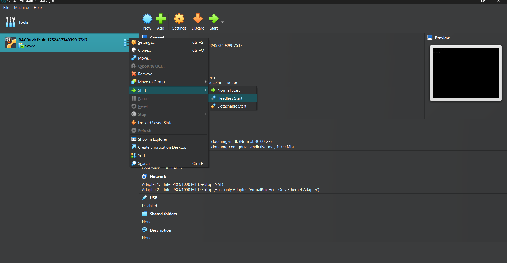

### **Prerequisite:**

A full Linux setup is required (do **not** use Docker Desktop, WSL,devcontainers).

---

## **One-time installation prerequisites**

| Windows                                                                                                              | macOS/Linux                                                        |
| -------------------------------------------------------------------------------------------------------------------- | ------------------------------------------------------------------ |
| [Visual Studio Code](https://code.visualstudio.com/) *(required)*                                                    | [Visual Studio Code](https://code.visualstudio.com/) *(required)*  |
| [Visual C++ Redistributable](https://learn.microsoft.com/en-us/cpp/windows/latest-supported-vc-redist?view=msvc-170) | *(not required)*                                                   |
| [Git](https://git-scm.com/downloads)                                                                                 | [Git](https://git-scm.com/downloads)                               |
| [Vagrant 2.4.3](https://developer.hashicorp.com/vagrant/downloads)                                                   | [Vagrant 2.4.3](https://developer.hashicorp.com/vagrant/downloads) |
| [VirtualBox 7.0.14](https://download.virtualbox.org/virtualbox/7.0.14/)                                                              | [VirtualBox 7.0.14](https://download.virtualbox.org/virtualbox/7.0.14/)            |

> **Note:** If using windows search windows features and **Turn off Hyper‑V , Windows Hypervisor Platform** and delete **Windows Subsystem for Linux (WSL2)** if possible 


---

## **Restart your system and get started**

> Open a **Git Bash** terminal and run the following command. The first run will take longer(20-30 minutes) as the Ubuntu Jammy VM will be downloaded. Select only Linux if prompted in vscode

```bash
rm -rf $HOME/RAG8s && mkdir $HOME/RAG8s && cd $HOME/RAG8s && git config --global core.autocrlf false && git clone https://github.com/Athithya-Sakthivel/RAG8s.git && cd RAG8s && bash utils/ssh.sh
```
> The default configs are RAM = 11GB, vcpus=10 and no gpu , override it in the Vagrantfile if needed 
---

## **Important: VM Lifecycle**

 ### **After a system reboot**, the VM will be shut down. Always start it manually before doing ssh.

  * Open VirtualBox → Right-click the VM → **Start → Headless Start and wait atleast 45-60 seconds before opening vscode**

  


### Login to your github account
```
make login
```

### Install the neccessary cli tools, py packages 
```
make install
```


