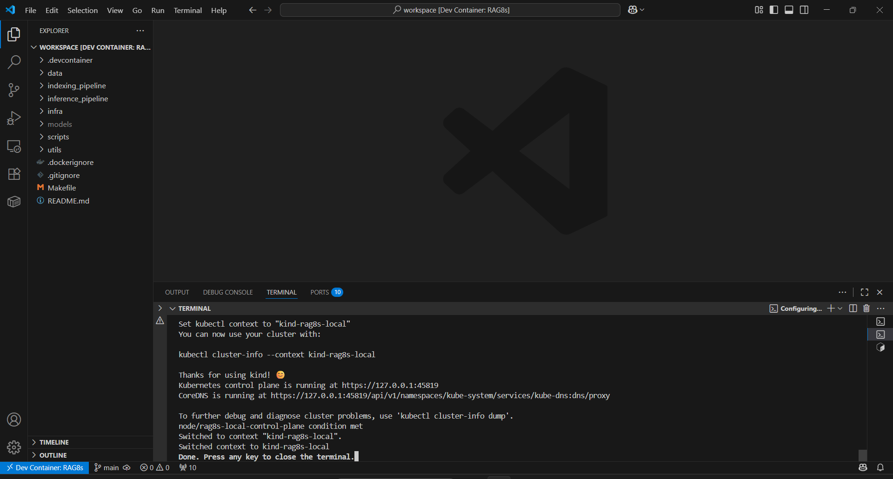

# Get started

## Prerequesities
 1. Docker enabled on boot and is running
 2. Vscode with `Dev Containers` extension installed
 3. AWS root account or IAM user with admin access for S3, EC2 and IAM role management(free tier sufficient if trying RAG8s locally)

# STEP 0/3 environment setup

#### Clone the repo and build the devcontainer
```sh 
git clone https://github.com/Athithya-Sakthivel/RAG8s.git && cd RAG8s && code .
ctrl + shift + P -> paste `Dev containers: Rebuild Container` and enter
```

#### This will take 20-30 minutes. If the image matches your system, you are ready to proceed.


#### Open a new terminal and login to your gh account
```sh
git config --global user.name "Your Name" && git config --global user.email you@example.com
gh auth login

? What account do you want to log into? GitHub.com
? What is your preferred protocol for Git operations? SSH
? Generate a new SSH key to add to your GitHub account? No
? How would you like to authenticate GitHub CLI? Login with a web browser

! First copy your one-time code: <code>
- Press Enter to open github.com in your browser... 
✓ Authentication complete. Press Enter to continue...

```
#### Create a private repo in your gh account
```sh
export REPO_NAME="rag8s"

git remote remove origin 2>/dev/null || true
gh repo create "$REPO_NAME" --private >/dev/null 2>&1
REMOTE_URL="https://github.com/$(gh api user | jq -r .login)/$REPO_NAME.git"
git remote add origin "$REMOTE_URL" 2>/dev/null || true
git branch -M main 2>/dev/null || true
git push -u origin main
git pull
git remote -v
echo "[INFO] A private repo '$REPO_NAME' created and pushed. Only visible from your account."

```

---


# STEP 2/3 INDEXING CRONJOB CONFIGS

```sh

export AWS_ACCESS_KEY_ID=""                           
export AWS_SECRET_ACCESS_KEY=""                       


export AWS_REGION="ap-south-1"                        # AWS region for infra and S3; change when your AWS resources are in another region (e.g., us-east-1)
export S3_BUCKET="e2e-rag-system-42"                  # Global S3 bucket name used for data/backups; must be globally unique — change per environment or tenant

export PLATFORMS="linux/amd64,linux/arm64"      # Multi arch default; set only amd64 for x86 EC2 (C5/C6/M5/M6/R5/R6) or only arm64 for Graviton (C7g/M7g/R7g)


export S3_RAW_PREFIX="data/raw/"                      # Prefix where raw/unprocessed files are uploaded; change to isolate different ingestion sources
export S3_CHUNKED_PREFIX="data/chunked/"              # Prefix where chunked/processed outputs are written; change to separate processed datasets
export OVERWRITE_DOC_DOCX_TO_PDF="true"               # If true, remove originals when converting (.doc/.docx) -> .pdf; set false to keep originals
export OVERWRITE_ALL_AUDIO_FILES="true"               # If true, remove originals when converting (.mp3,.aac/etc) -> (16k wav); false to keep originals
export OVERWRITE_SPREADSHEETS_WITH_CSV="true"         # If true, remove originals when converting (.xls/.xlsx/.ods/etc) to .csv ;false to keep originals
export OVERWRITE_PPT_WITH_PPTS="true"                 # If true, remove orignals when converting .ppt -> .pptx;false to keep originals
export MAX_TOKENS_PER_CHUNK="320"                     # Cummulatively append text sentences of .pdf, .html, .mp3, .png ,etc as a chunk till this token limit  
export MIN_TOKENS_PER_CHUNK="100"                     # Minimum tokens; if chunk < this, append to previous chunk — adjust to avoid tiny fragments
export NUMBER_OF_OVERLAPPING_SENTENCES="2"            # Sentence overlap between adjacent chunks to improve recall; increase for precision at cost of redundancy
export PDF_DISABLE_OCR="false"                        # true to skip OCR (fast but miss scanned text); false to enable OCR for scanned/embedded text
export PDF_OCR_ENGINE="rapidocr"                      # 'tesseract' or 'rapidocr' — choose rapidocr for higher accuracy, tesseract for lightweight/multilingual
export PDF_TESSERACT_LANG="eng"                       # (if tess)Language code for tesseract; change only if using tesseract and target language differs
export IMAGE_TESSERACT_LANG="eng"                     # (if tess)tesseract language for image OCR; change only with tesseract and single-language images
export TESSERACT_CONFIG="--oem 1 --psm 6"             # (if tess) Tesseract runtime flags; use --psm 3 for full-page OCR or keep 6 for block segmentation
export PDF_FORCE_OCR="false"                          # true to force OCR even when PDF has text layer (useful for noisy text), false to preserve native text
export PDF_OCR_RENDER_DPI="400"                       # DPI used when rendering PDF pages for OCR; increase for very small text, reduce for speed
export PDF_MIN_IMG_SIZE_BYTES="3072"                  # Skip OCR for images below this size; lower to include smaller images, increase to ignore artifacts
export IMAGE_OCR_ENGINE="rapidocr"                    # 'tesseract' or 'rapidocr' for standalone images; choose based on accuracy/speed tradeoff
export IMAGE_MIN_IMG_SIZE_BYTES="3072"                # Skip OCR for images smaller than this; reduce to process thumbnails, increase to avoid noise
export IMAGE_RENDER_DPI="600"                         # DPI when rendering images for OCR; increase for tiny text, lower for better throughput
export IMAGE_UPSCALE_FACTOR="2.0"                     # Upscale small images before OCR; increase for very small/blurred text, decrease for performance
export CSV_TARGET_TOKENS_PER_CHUNK="600"              # Token budget for CSV chunking (including header); increase for wide tables, decrease to split more
export JSONL_TARGET_TOKENS_PER_CHUNK="600"            # Token budget for JSONL chunking; similar guidance as CSV
export PPTX_SLIDES_PER_CHUNK="4"                      # Slides grouped per chunk; increase when slides are short, decrease when slides have lots of text
export PPTX_OCR_ENGINE="rapidocr"                     # OCR engine for PPTX-rendered images; same selection guidance as other OCR engine vars
export PYTHONUNBUFFERED="1"                           # Forces Python stdout/stderr unbuffered so container logs are immediate; keep set in containers


export QDRANT_API_KEY="mypassword"                  # Qdrant auth key (sensitive); supply via k8s Secret when Qdrant requires auth
export COLLECTION_NAME="default_rag_collection1"    # Qdrant collection name; change per environment/dataset to avoid collisions
export DENSE_DIM="384"                              # Expected dense vector dimensionality; MUST match the model served at DENSE_URL
export BATCH_SIZE="16"                              # Number of chunks sent per embedding batch; increase for throughput, decrease for memory/latency
export UPSERT_CHUNK="500"                           # Points per Qdrant upsert call; larger reduces API overhead but increases request size
export SPARSE_BATCH_FALLBACK="8"                    # Micro-batch size used when sparse service rejects large batches (422)
export QDRANT_HNSW_EF_CONSTRUCT="128"               # HNSW index build depth; higher improves recall but increases index-build time and CPU cost
export QDRANT_HNSW_M="32"                           # HNSW max graph connections per node; higher boosts recall but raises RAM usage per vector
export QDRANT_HNSW_FULL_SCAN_THRESHOLD="10000"      # Point-count threshold affecting full-scan vs HNSW behavior
export QDRANT_ONDISK="TRUE"                         # TRUE/1/YES => enable on-disk HNSW (saves RAM without much increase in latency if using local NVMe EC2s)

export INDEXING_CRONJOB_TIMEZONE="Asia/Kolkata"     # or "Etc/UTC", "Europe/Berlin", "America/New_York" or https://cronjob.live/docs/cron-timezones
export CRON_SCHEDULE="0 */6 * * *"                   # Runs at minute 0 every 6 hours; or adjust fields to alter minute/hour/day
export CRONJOB_CONCURRENCY="Allow"                    # ConcurrencyPolicy (Allow/Forbid/Replace); choose per desired parallel execution behavior
export CRONJOB_BACKOFF_LIMIT="2"                      # Number of retries for failed Jobs; increase for transient failure tolerance
export CRONJOB_PARALLELISM="2"                        # Max parallel pods for a single Job; increase only for partitioned workloads
export CRONJOB_COMPLETIONS="1"                         # Number of successful completions required; default uses parallelism if unset
export CRONJOB_DEBUG_KEEP_POD="false"                 # If true, pods sleep after work to allow debugging; set true only for dev/debug
export INDEXING_BACKUP_CRONJOB_CPU_REQUEST="2"     # CPU request for the CronJob container; raise for CPU-heavy workloads
export INDEXING_BACKUP_CRONJOB_CPU_LIMIT="4"          # CPU limit for the CronJob container; set to cap CPU usage
export INDEXING_BACKUP_CRONJOB_MEMORY_REQUEST="1Gi"   # Memory request for CronJob; set based on worst-case memory used by indexing
export INDEXING_BACKUP_CRONJOB_MEMORY_LIMIT="2Gi"     # Memory limit for CronJob; must be >= request to avoid eviction
export INDEXING_PIPELINE_CPU_IMAGE_REPO="athithya5354/indexing_pipeline_cpu"  # Use the prebuilt docker image or build your own by running `make index-image`
export INDEXING_PIPELINE_CPU_IMAGE_TAG="amd64-arm64-v7" # Set a consistent tag name for clarity. You may change if building your own image


export AWS_REGION="${AWS_REGION:-ap-south-1}"

export PULUMI_S3_BUCKET="${PULUMI_S3_BUCKET:-e2e-rag-42}"
export S3_BUCKET="${S3_BUCKET:-${PULUMI_S3_BUCKET}}"
export S3_PREFIX="${S3_PREFIX:-pulumi/}"
export PULUMI_STATE_BUCKET="${PULUMI_STATE_BUCKET:-${PULUMI_S3_BUCKET}}"
export PULUMI_STATE_PREFIX="${PULUMI_STATE_PREFIX:-${S3_PREFIX}}"
export DDB_TABLE="${DDB_TABLE:-pulumi-state-locks}"

export PULUMI_STACK="${PULUMI_STACK:-prod}"
export STACK="${STACK:-${PULUMI_STACK}}"
export PULUMI_CONFIG_PASSPHRASE="${PULUMI_CONFIG_PASSPHRASE:-password}"

export ENABLE_PULUMI_AUTOINIT="${ENABLE_PULUMI_AUTOINIT:-true}"
export PIP_BREAK_SYSTEM_PACKAGES_FLAG="${PIP_BREAK_SYSTEM_PACKAGES_FLAG:---no-input}"
export PULUMI_LOGIN_URL="${PULUMI_LOGIN_URL:-s3://${S3_BUCKET}/${S3_PREFIX}}"
export PULUMI_PYTHON_CMD="${PULUMI_PYTHON_CMD:-${VENV_DIR}/bin/python}"

# ---- Minimal-Cost Defaults Below ----
export AVOID_DOMAIN="${AVOID_DOMAIN:-true}"
export MULTI_AZ_DEPLOYMENT="${MULTI_AZ_DEPLOYMENT:-true}"
export AZ_COUNT="${AZ_COUNT:-3}"
export VPC_CIDR="${VPC_CIDR:-10.0.0.0/16}"
export PUBLIC_SUBNET_CIDRS="${PUBLIC_SUBNET_CIDRS:-}"
export PRIVATE_SUBNET_CIDRS="${PRIVATE_SUBNET_CIDRS:-}"

# >>> COST MINIMAL DEFAULTS <<<
export NO_NAT="${NO_NAT:-true}"                         # ✔ No NAT Gateways (major cost saving)
export NAT_SINGLE="${NAT_SINGLE:-false}"                # irrelevant when NO_NAT=true
export CREATE_VPC_ENDPOINTS="${CREATE_VPC_ENDPOINTS:-true}"  
export CREATE_VPC_ENDPOINT_SERVICES="${CREATE_VPC_ENDPOINT_SERVICES:-s3,ecr.api,ecr.dkr,ssm,sts}"

export ENABLE_FLOW_LOGS="${ENABLE_FLOW_LOGS:-false}"    # ✔ avoid CloudWatch ingestion charges
export FLOW_LOG_DEST="${FLOW_LOG_DEST:-cloudwatch}"
export FLOW_LOG_S3_BUCKET="${FLOW_LOG_S3_BUCKET:-}"

export TAG_PREFIX="${TAG_PREFIX:-pulumi}"


export FORCE_CPU="1"                             # Forces CPU inference; set 0 only if GPU-enabled embedder image exists and nodes have GPUs
export EMBEDDER_READY_TIMEOUT="600"              # Max seconds to wait for model load; increase for very large ONNX models or slow disks
export EMBEDDER_REPLICAS="1"                     # Number of embedder pods; increase only when handling high concurrent embedding traffic
export EMBEDDER_CPU_REQUEST="2"                  # Guaranteed CPU for the embedder; raise to smooth latency under load
export EMBEDDER_CPU_LIMIT="4"                    # Hard CPU cap; increase if batching + concurrency cause throttling
export EMBEDDER_MEM_REQUEST="2Gi"                # Guaranteed RAM; raise when not using the default models
export EMBEDDER_MEM_LIMIT="4Gi"                  # Hard RAM cap; increase if OOM occurs during ONNX graph load or large batch runs


export QDRANT_URL="http://localhost:6333"          # Qdrant HTTP endpoint. Change to remote host when using managed Qdrant.
export COLLECTION_NAME="rag_hybrid_collection"     # Qdrant collection name. Change per dataset/environment.
export DATA_DIR="/workspace/data/chunked"          # Local fallback directory containing chunked JSON files.
export DENSE_MODEL_NAME="BAAI/bge-small-en-v1.5"   # or https://qdrant.github.io/fastembed/examples/Supported_Models/
export DENSE_DIM="384"                             # Dense embedding dim (must match model); used to create collection.
export SPARSE_MODEL_NAME="prithivida/Splade_PP_en_v1" # Splade++ embedder for lexical matching
export RERANK_MODEL_NAME="Xenova/ms-marco-MiniLM-L-6-v2" # Cross-encoder reranker model. 
export BATCH_SIZE="16"                             # Indexing batch size for processing chunks (embedding step).
export UPSERT_CHUNK="500"                          # Number of points sent in each upsert to Qdrant.
export MAX_CHARS_PER_PART="1400"                   # Max characters to keep per chunk part (controls splitting).
export LARGE_UPLOAD_THRESHOLD="100000"             # If total points exceed this and client supports upload_points, use it.
export RERANKER_MODE="AUTO"                        # DISABLE|ALWAYS|AUTO. AUTO uses thresholds to decide rerank.
export RERANK_TOPK="20"                            # Number of top candidates sent to reranker when triggered.
export RERANKER_TOP_K="$RERANK_TOPK"               # Alias for backward compatibility.
export RERANK_AUTO_THRESHOLD="0.75"                # If fused top score >= this, skip rerank in AUTO (higher => fewer reranks).
export RERANK_THRESHOLD="30"                       # Rank-disagreement threshold (abs(dense_rank-sparse_rank)) to trigger rerank.
export RERANK_MARGIN="0.08"                        # If top-second fused-gap < this, rerank (tie-breaker).
export RERANK_ALPHA="0.6"                          # When combining reranker & fused scores (0..1 weight on reranker).
export MAX_CHUNKS_TO_LLM="6"                       # Max chunks to prepare/send to LLM (safety/perf).
export QUERY_TOPK_DENSE="200"                      # Prefetch top-k dense results for RRF fusion (larger=slower, better recall).
export QUERY_TOPK_SPARSE="200"                     # Prefetch top-k sparse results for RRF fusion.
export RRF_TOP_N="10"                              # Number of fused (deduped) top results to return for reranker/LLM.
export QDRANT_HNSW_EF_CONSTRUCTION="128"           # HNSW efConstruction parameter (build-time recall/speed tradeoff).
export QDRANT_HNSW_M="32"                          # HNSW M parameter (graph connectivity / RAM tradeoff).
export QDRANT_ONDISK="FALSE"                       # TRUE lowers RAM (on-disk store) at cost of speed.
export HTTP_TIMEOUT="30.0"                         # HTTP timeout for external requests (seconds).
export LOGLEVEL="INFO"                             # Logging verbosity (DEBUG|INFO|WARNING|ERROR).


```


