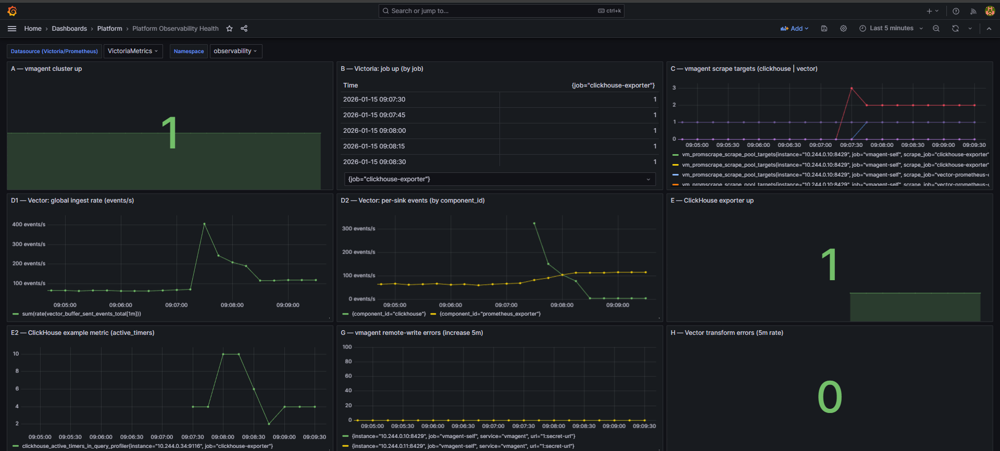
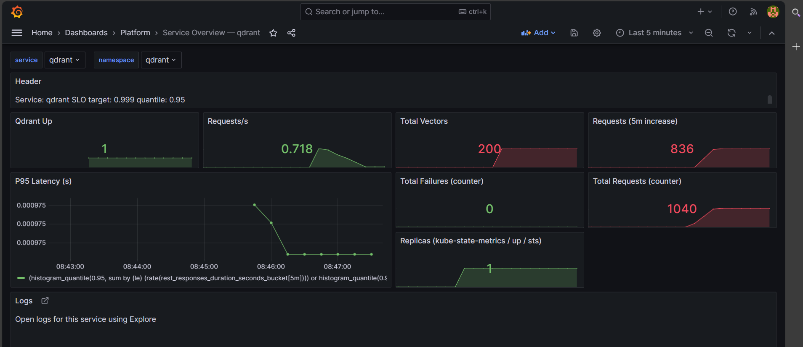
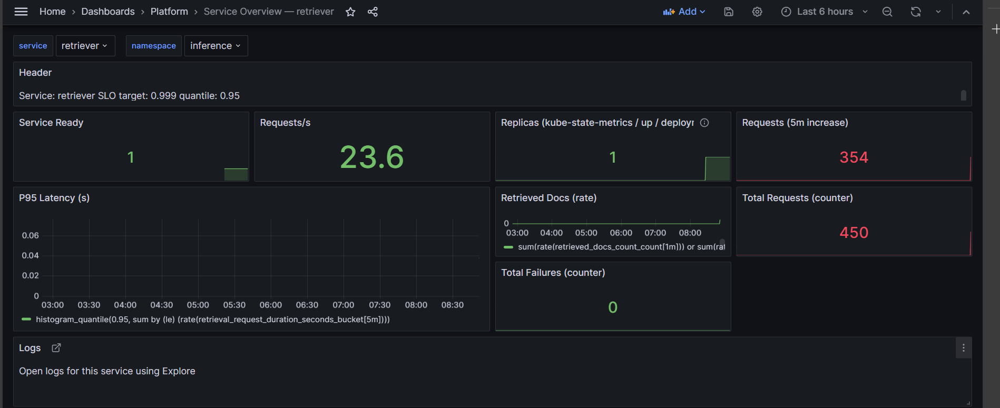

[Watch the demo video](infra/archive/RAG8s.mp4)

---
**RAG8s** is an opinionated, Azure-native, Kubernetes-first framework for building and running **production-grade hybrid Retrieval-Augmented Generation (RAG) systems**.

It provides a complete, end-to-end reference architecture for RAG on **Azure Kubernetes Service (AKS)**—from document ingestion to LLM inference. RAG8s is designed for teams that care about **reliability, scalability, and operational correctness**, not just model experimentation.

The framework clearly separates the RAG lifecycle into two planes:

* **Batch indexing plane**
  A scheduled and idempotent pipeline that ingests documents from Azure Blob Storage, performs normalization and OCR, chunks content, generates dense and sparse embeddings, and indexes data into **Qdrant** with configurable sharding, replication, and backups.

* **Online inference plane**
  A low-latency request path that performs hybrid retrieval (dense + sparse), optional cross-encoder reranking, deterministic prompt construction with strict grounding, and LLM invocation, returning cited responses to authenticated users.

RAG8s is **Azure-native by design**. Infrastructure is declared using **Pulumi**, workloads run on **AKS**, and storage and backups use **Azure Blob Storage**. Node pools are deliberately separated to isolate system services, inference APIs, compute-heavy model workloads, and vector storage. All container images are built deterministically and deployed via standard registries.

Security and operations are first-class concerns. External access is provided through **Cloudflare Tunnel**, authentication uses OAuth (Google, Microsoft, GitHub) with JWT sessions, and secrets are managed using native Kubernetes primitives. Observability is built in by default using **VictoriaMetrics**, **ClickHouse**, **Grafana**, and **Alertmanager/vmalert**.

By combining hybrid retrieval, clear batch and online separation, declarative infrastructure, and built-in observability, RAG8s serves as a **solid foundation for running RAG systems in real production environments**.

---

# Get started

## Prerequisites
1. **Docker installed, enabled on boot, and running**
2. **Visual Studio Code with the Dev Containers extension installed (for a deterministic environments): [https://code.visualstudio.com/docs/devcontainers/containers](https://code.visualstudio.com/docs/devcontainers/containers)**
3. **An Azure subscription with sufficient permissions (Owner or Contributor) to manage**:
   * Azure Resource Groups
   * Azure Kubernetes Service (AKS)
   * Azure Storage Accounts (Blob)
   * Managed Identities and role assignments
**A free trial or Azure for students subscription is sufficient for development and testing purposes**
4. **A Cloudflare account with a registered domain, with permissions to manage DNS records and create Cloudflare Tunnels (cloudflared)**

## Clone the repo and build the devcontainer(Reproducible). This will take 20-30 minutes. 
```sh 
cd $HOME && rm -rf RAG8s && git clone https://github.com/Athithya-Sakthivel/RAG8s.git && cd RAG8s && code .
```
> ctrl + shift + P -> paste `Dev containers: Rebuild Container Without Cache` and enter

#### Open a new terminal and login to your gh account
```sh
git config --global user.name "Your Name" && git config --global user.email you@example.com
gh auth login

? What account do you want to log into? GitHub.com
? What is your preferred protocol for Git operations? SSH
? Generate a new SSH key to add to your GitHub account? No
? How would you like to authenticate GitHub CLI? Login with a web browser

! First copy your one-time code: <code>
- Press Enter to open github.com in your browser... 
✓ Authentication complete. Press Enter to continue...

```
#### Create a private repo in your gh account
```sh
export REPO_NAME="rag8s" # or any name

git remote remove origin 2>/dev/null || true
gh repo create "$REPO_NAME" --private >/dev/null 2>&1
REMOTE_URL="https://github.com/$(gh api user | jq -r .login)/$REPO_NAME.git"
git remote add origin "$REMOTE_URL" 2>/dev/null || true
git branch -M main 2>/dev/null || true
git push -u origin main
git pull
git remote -v
echo "[INFO] A private repo '$REPO_NAME' created and pushed. Only visible from your account."

```

#### Run `az login` and export the correct subscription ID

```sh
export AZURE_SUBSCRIPTION_ID="" # Azure subscription hosting AKS, storage, and all RAG platform resources
```

### STEP 1: Provision the Azure Storage Account and required Blob containers by exporting the variables below and running make create-sa (remove with make delete-sa).

```sh
export AZURE_SUBSCRIPTION_ID="${AZURE_SUBSCRIPTION_ID}"   # Azure subscription ID (must already be set after az login)
export AZURE_RESOURCE_GROUP_NAME="rg-e2e-rag"             # Resource group hosting storage account and platform infra
export AZURE_ENDPOINT_SUFFIX="core.windows.net"           # Override this only for sovereign clouds (e.g., Azure China or Gov)
export AZURE_LOCATION="eastus"                            # Azure region for all Azure resources
export AZURE_STORAGE_ACCOUNT_NAME="defaultsa515"          # Azure Storage Account name (3–24 chars, lowercase, globally unique)
export STORAGE_TIER="LRS"                                 # Storage redundancy tier (LRS | ZRS | GRS | RAGRS | GZRS | RAGZRS)
export AZURE_CONTAINER="rag-data-515"                     # Primary Blob container for RAG data
export PULUMI_AZ_CONTAINER="pulumi-state-515"             # Pulumi backend container (state + locking)
export BACKUP_AZ_CONTAINER="backups-515"                  # Backup Blob container (snapshots, archives)
export BACKUP_PREFIX="qdrant/backup"                      # Subdirectory inside backup container (e.g., backups/qdrant/)
export BACKUP_AZ_CONTAINER_COOL_AFTER_DAYS=7              # Move backup blobs to Cool tier after N days
export BACKUP_AZ_CONTAINER_RETENTION_DAYS=30              # Permanently delete backup blobs after N days
export AZURE_STORAGE_CONNECTION_STRING="$(python3 infra/base_infra/get_storage_conn_string.py)"
# make create-sa
export AZURE_DELETE_ACCOUNT=0                             # 1 = delete entire storage account on `make delete-sa`, 0 = containers only
export FORCE_DELETE=1                                     # Skip interactive confirmation prompts
# make delete-sa
```

### STEP 2: Manage platform infrastructure with Pulumi: export all required environment variables, run `make pulumi-preview` to inspect changes, `make pulumi-up` to apply them, or `make pulumi-destroy` to delete resources (destructive; requires PULUMI_FORCE_DESTROY=1). [Docs](docs/infra/azure).
> NOTE: Node selectors and taints are not yet implemented. Only `systemnodepool` and `workernodepool` have been tested.

```sh
export PULUMI_STACK="staging"                     # Pulumi state scope (infra boundary); PROD: "prod"
export PULUMI_CONFIG_PASSPHRASE="mypassword"      # Pulumi secrets encryption; PROD: strong rotated secret
export AKS_MAX_PODS=60                            # Pod density per node (Azure CNI IP pressure); PROD: raise if subnet allows
export AKS_CLUSTER_NAME="rag-aks"                 # AKS cluster name; change only for parallel clusters/environments
export AKS_SKU="standard"                         # Control-plane SLA tier; PROD: standard (or premium if regulated)
export SYSTEM_NODE_COUNT=1                        # System pool (kube-system, CNI, CoreDNS); PROD: >=2 (prefer 3)
export SYSTEM_NODE_VM_SIZE="Standard_B2s"         # System pool VM (infra-only); PROD: D4s_v5+ for stability
export SYSTEM_NODE_MAX_PODS=60                    # System pod density; must align with AKS_MAX_PODS
export BALANCED_NODE_MIN=0                        # General app pool (APIs, gateways, orchestrators); PROD: >=2 for HA
export BALANCED_NODE_MAX=1                        # General app scale ceiling; raise with QPS/latency targets
export BALANCED_NODE_VM_SIZE="Standard_B2s"       # App/API workloads; PROD: D4s_v5 for concurrency
export CPU_HEAVY_NODE_MIN=0                       # CPU model pool (embeddings, rerankers, tokenizers); PROD: >=1 if hot path
export CPU_HEAVY_NODE_MAX=0                       # CPU burst capacity (batch inference, indexing); PROD: raise as needed
export CPU_HEAVY_NODE_VM_SIZE="Standard_B2s"      # CPU inference placeholder; PROD: F8s_v2 (AVX2, predictable clocks)
export QDRANT_NODE_COUNT=0                        # Vector DB pool (Qdrant, HNSW, WAL); PROD: 1+ for HA/sharding
export QDRANT_NODE_VM_SIZE="Standard_B2s"         # RAM/IO-heavy vector storage; PROD: E8ds_v5 / E16ds_v5
export AKS_LOCATION="${AZURE_LOCATION}"   # Deployment region; change only for latency or quota management
export ACR_NAME=acr49250                                   # Global ACR name; change only if creating a new registry (cannot rename)
export ACR_REPO_PREFIX=rag                              # Logical repo namespace; change when multiple teams/apps share one ACR
export ACR_LOCATION="${AKS_LOCATION:-${AZURE_LOCATION:-eastus}}"  # Region; change only if co-locating with AKS or for compliance
export ACR_SKU=Basic        # All RAG8s images fits into the Basic plan 10GiB yet `Standard` required for prod throughput
export PULUMI_FORCE_DESTROY=1                     # Allow destructive changes (staging safety off); PROD: 0
# make pulumi-destroy
```

### STEP 3: Manage kubectl context — run `make set-aks-context` to connect to AKS, or `make delete-aks-context` to fully remove local AKS credentials and kubeconfig entries. 
> If locally testing, run `make lc` to create a kind cluster, and use `make set-kind-context` to switch between AKS and kind.

### STEP 4: Rollout the Qdrant StatefulSet and services into AKS by running make rollout-qdrant (remove it with make delete-qdrant).

```sh
export QDRANT__SERVICE__API_KEY="strongpassword1"          # Server-side API auth key; rotate on compromise or scheduled security rotation
export QDRANT_REPLICAS=3                                   # Set to 1 (dev), 3 (min HA), or >=5 (prod quorum); must be >= QDRANT_REPLICATION_FACTOR
export QDRANT_PERSISTENCE_ENABLED=true                     # Set to false when using Azure local NVMe disks (per-pod qdrant backups also supported)
export QDRANT_PERSISTENCE_SIZE="50Gi"                      # Increase to 100Gi+ before disk hits 70%; never shrink an existing PVC
export QDRANT_PERSISTENCE_STORAGE_CLASS="managed-premium"  # Change only when switching cloud, region, or disk tier (e.g. premium → standard)
export QDRANT_CPU_REQUEST="1"                              # Increase to 2+ if sustained CPU >70%; keep <= node allocatable / replicas
export QDRANT_CPU_LIMIT="2"                                # Set equal to request for deterministic perf; raise only to allow controlled bursting
export QDRANT_MEMORY_REQUEST="2Gi"                         # Increase to 4Gi+ when HNSW build or mmap usage grows; must fit node memory
export QDRANT_MEMORY_LIMIT="4Gi"                           # Always >= request; raise only to avoid OOMKills, never rely on overcommit
```


### STEP 5.1: Select the dense embedding model and embedding dimension (FastEmbed-compatible)

Choose a FastEmbed-supported dense text embedding model and its output dimension
(see: [https://qdrant.github.io/fastembed/examples/Supported_Models/#supported-text-embedding-models](https://qdrant.github.io/fastembed/examples/Supported_Models/#supported-text-embedding-models)).

```sh
export DENSE_MODEL_NAME="jinaai/jina-embeddings-v2-small-en"  # Canonical FastEmbed model ID; changing this requires rebuilding the image
export DENSE_DIM=512                                         # Fixed embedding vector size emitted by the model; must match Qdrant collection schema
export DENSE_IMAGE_TAG=v1                                    # Immutable image tag for this model+dim combination (<registry>/dense:<tag>)
make dense-image
```

### STEP 5.2: Rollout the dense embedding service to AKS

After the image build completes, identify the pushed image (registry URL, e.g. `*.azurecr.io/...`) and export it as `DENSE_IMAGE`. Rollout using `make rollout-dense`; remove with `make delete-dense`.

```sh
export DENSE_IMAGE=""                         # Fully qualified image reference pushed to registry (must match model+dim baked at build time)
export DENSE_REPLICAS=1                       # Desired steady-state pod count; PROD requires >=2 for availability
export DENSE_CPU_REQUEST="250m"               # Guaranteed CPU reserved per pod for scheduler placement and latency stability
export DENSE_CPU_LIMIT="1000m"                # Upper CPU bound per pod to prevent noisy-neighbor contention
export DENSE_MEMORY_REQUEST="512Mi"           # Guaranteed memory reservation; must cover model weights + runtime buffers
export DENSE_MEMORY_LIMIT="1Gi"               # Hard memory cap; exceeding this will OOM-kill the pod

# Optional: Horizontal Pod Autoscaler (HPA)
export DENSE_HPA_ENABLED=false                # Toggles HPA generation; when true, DENSE_REPLICAS becomes the initial replica count
export DENSE_HPA_MIN_REPLICAS=1               # Lower bound for autoscaling to maintain baseline capacity
export DENSE_HPA_MAX_REPLICAS=10              # Upper bound to control cost and prevent runaway scaling
export DENSE_HPA_TARGET_CPU=60                # Target average CPU utilization (%) used by HPA for scaling decisions

make rollout-dense
# make delete-dense
```

### STEP 6.1: Select the sparse embedding model (FastEmbed-compatible)

Choose a FastEmbed-supported **sparse** text embedding model.
Sparse models emit token-weight maps (vocab-based), not fixed-size vectors, so **no dimension variable is required**. [https://qdrant.github.io/fastembed/examples/Supported_Models/#supported-sparse-text-embedding-models](https://qdrant.github.io/fastembed/examples/Supported_Models/#supported-sparse-text-embedding-models)

```sh
export SPARSE_MODEL_NAME="Qdrant/minicoil-v1"   # Canonical FastEmbed sparse model ID; changing this requires rebuilding the image
export SPARSE_IMAGE_TAG=v1                     # Immutable image tag for this model (<registry>/sparse:<tag>)
make sparse-image
```

---

### STEP 6.2: Rollout the sparse embedding service to AKS

After the image build completes, identify the pushed image (registry URL, e.g. `*.azurecr.io/...`) and export it as `SPARSE_IMAGE`.
Rollout using `make rollout-sparse`; remove with `make delete-sparse`.

```sh
export SPARSE_IMAGE=""                        # Fully qualified image reference pushed to registry (must match model baked at build time)
export SPARSE_REPLICAS=1                      # Desired steady-state pod count; PROD requires >=2 for availability
export SPARSE_CPU_REQUEST="250m"              # Guaranteed CPU reserved per pod; sparse models are CPU-light but latency-sensitive
export SPARSE_CPU_LIMIT="1000m"               # Upper CPU bound per pod to prevent noisy-neighbor contention
export SPARSE_MEMORY_REQUEST="512Mi"          # Guaranteed memory; must cover model weights + tokenizer + runtime buffers
export SPARSE_MEMORY_LIMIT="1Gi"              # Hard memory cap; exceeding this will OOM-kill the pod

# Optional: Horizontal Pod Autoscaler (HPA)
export SPARSE_HPA_ENABLED=false               # Toggles HPA generation; when true, SPARSE_REPLICAS becomes the initial replica count
export SPARSE_HPA_MIN_REPLICAS=1              # Lower bound to maintain baseline sparse capacity
export SPARSE_HPA_MAX_REPLICAS=10             # Upper bound to control cost and prevent runaway scaling
export SPARSE_HPA_TARGET_CPU=60               # Target average CPU utilization (%) for autoscaling decisions

make rollout-sparse
# make delete-sparse
```


### STEP 7: Provision and operate the batch indexing CronJob (idempotent RAG indexing). [Docs](docs/indexing_cronjob/workflow.md)

Creates a Kubernetes CronJob that executes the end-to-end indexing pipeline on a schedule (`make rollout-indexing-cronjob`), supports safe teardown (`make delete-indexing-cronjob`), and allows one-off manual execution for validation and debugging (`make run-indexing-cronjob`).
All RAG source data **must already be present** under `AZURE_CONTAINER/STORAGE_RAW_PREFIX` before the CronJob runs.

> **Testing only:** To seed sample data, you may upload files from the local `data/raw/` directory to `AZURE_CONTAINER/STORAGE_RAW_PREFIX` using
> `python3 infra/base_infra/force_sync_azure_and_local_fs.py --merge-upload`. This performs a merge upload and does not delete existing blobs

```sh
export STORAGE_RAW_PREFIX=data/raw/                 # Blob path prefix containing raw, unprocessed source documents
export STORAGE_CHUNKED_PREFIX=data/chunked/         # Blob path prefix where normalized, chunked outputs are written
export AZURE_STORAGE_CONNECTION_STRING=$(python3 infra/base_infra/get_storage_conn_string.py)  # SA string used by the CronJob for all blob I/O

export OVERWRITE_DOC_DOCX_TO_PDF="true"          # If true, remove originals when converting (.doc/.docx) -> .pdf; set false to keep originals
export OVERWRITE_ALL_AUDIO_FILES="true"          # If true, remove originals when converting (.mp3,.aac/etc) -> (16k wav); false to keep originals
export OVERWRITE_SPREADSHEETS_WITH_CSV="true"    # If true, remove originals when converting (.xls/.xlsx/.ods/etc) to .csv ;false to keep originals
export OVERWRITE_PPT_WITH_PPTS="true"                 # If true, remove orignals when converting .ppt -> .pptx;false to keep originals

export MAX_TOKENS_PER_CHUNK="320"       # Cummulatively append text sentences of .pdf, .html, .mp3, .png ,etc as a chunk till this token limit  
export MIN_TOKENS_PER_CHUNK="100"                     # Minimum tokens; if chunk < this, append to previous chunk — adjust to avoid tiny fragments
export NUMBER_OF_OVERLAPPING_SENTENCES="2"            # Sentence overlap between adjacent chunks to improve recall; increase for precision 
export PDF_DISABLE_OCR="false"                        # true to skip OCR (fast but miss scanned text); false to enable OCR for scanned/embedded text
export PDF_OCR_ENGINE="rapidocr"                      # 'tesseract' or 'rapidocr' — choose rapidocr for higher accuracy, tesseract for multilingual
export PDF_TESSERACT_LANG="eng"             # (if tess)Language code for tesseract; change only if using tesseract and target language differs
export IMAGE_TESSERACT_LANG="eng"           # (if tess)tesseract language for image OCR; change only with tesseract and single-language images
export TESSERACT_CONFIG="--oem 1 --psm 6"   # (if tess) Tesseract runtime flags; use --psm 3 for full-page OCR or keep 6 for block segmentation
export PDF_FORCE_OCR="false"                # true to force OCR even when PDF has text layer (useful for noisy text), false to preserve native text
export PDF_OCR_RENDER_DPI="400"                       # DPI used when rendering PDF pages for OCR; increase for very small text, reduce for speed
export PDF_MIN_IMG_SIZE_BYTES="3072"        # Skip OCR for images below this size; lower to include smaller images, increase to ignore artifacts
export IMAGE_OCR_ENGINE="tesseract"         # 'tesseract' or 'rapidocr' for standalone images; choose based on accuracy/speed tradeoff
export IMAGE_MIN_IMG_SIZE_BYTES="3072"                # Skip OCR for images smaller than this; reduce to process thumbnails, increase to avoid noise
export IMAGE_RENDER_DPI="400"                         # DPI when rendering images for OCR; increase for tiny text, lower for better throughput
export IMAGE_UPSCALE_FACTOR="2.0"                     # Upscale small images before OCR; increase for very small/blurred text, decrease for performance
export CSV_TARGET_TOKENS_PER_CHUNK="400"    # Token budget for CSV chunking (including header); increase for wide tables, decrease to split more
export JSONL_TARGET_TOKENS_PER_CHUNK="400"            # Token budget for JSONL chunking; similar guidance as CSV
export PPTX_SLIDES_PER_CHUNK="4"            # Slides grouped per chunk; increase when slides are short, decrease when slides have lots of text
export PPTX_OCR_ENGINE="rapidocr"                     # OCR engine for PPTX-rendered images; same selection guidance as other OCR engine vars
export PYTHONUNBUFFERED="1"                           # Forces Python stdout/stderr unbuffered so container logs are immediate; keep set in containers

export COLLECTION_NAME="default_rag_collection1"    # Qdrant collection name; change per environment/dataset to avoid collisions
export DENSE_DIM=384                                # Expected dense vector dimensionality; MUST match the model served at DENSE_URL
export BATCH_SIZE="8"                               # Number of chunks sent per embedding batch; increase for throughput, decrease for memory/latency
export UPSERT_CHUNK="500"                           # Points per Qdrant upsert call; larger reduces API overhead but increases request size
export SPARSE_BATCH_FALLBACK="8"                    # Micro-batch size used when sparse service rejects large batches (422)

export QDRANT_SHARD_NUMBER="3"             # Number of shards per collection; controls horizontal scaling and parallelism (set at collection creation)
export QDRANT_REPLICATION_FACTOR="2"        # Number of replicas per shard; controls availability and durability (collection creation only)
export QDRANT_WRITE_CONSISTENCY_FACTOR="1"          # How many replicas must confirm a write; higher = safer writes, lower availability
export QDRANT_API_KEY=$QDRANT__SERVICE__API_KEY     # API key used by indexer to authenticate to Qdrant
export QDRANT_HNSW_EF_CONSTRUCT="128"               # HNSW build depth; higher improves recall but increases index-build CPU/time
export QDRANT_HNSW_M="32"                           # HNSW max connections per node; higher improves recall but increases RAM per vector
export QDRANT_HNSW_FULL_SCAN_THRESHOLD="10000"      # Vector-count threshold below which brute-force search is preferred over HNSW
export QDRANT_ONDISK="false"    # TRUE/1/YES => enable on-disk HNSW (saves RAM without much increase in latency if using local NVMe VMs)

export INDEX_TIMEOUT=1800          # Max allowed runtime (seconds) for index.py before forced termination
export BACKUP_TIMEOUT=300          # Max allowed runtime (seconds) for Qdrant backup execution
export ENABLE_QDRANT_BACKUP=true               # master switch: set false to disable all backups during indexing or if manual backups required
export MIN_INDEXED_POINTS_FOR_BACKUP=100       # minimum newly indexed points required to trigger backup
export MIN_INDEX_DELTA_RATIO_FOR_BACKUP=0.0    # Relative growth threshold (new / existing); 0.0 disables, e.g. 0.05 = 5% growth

export INDEXING_CRONJOB_TIMEZONE="Asia/Kolkata"     # or "Etc/UTC", "Europe/Berlin", "America/New_York" or https://cronjob.live/docs/cron-timezones
export CRON_SCHEDULE="0 */6 * * *"                   # Runs at minute 0 every 6 hours; or adjust fields to alter minute/hour/day
export CRONJOB_CONCURRENCY="Allow"                    # ConcurrencyPolicy (Allow/Forbid/Replace); choose per desired parallel execution behavior
export CRONJOB_BACKOFF_LIMIT="1"                      # Number of retries for failed Jobs; increase for transient failure tolerance
export CRONJOB_MAX_TIME="3600"                         # Kubernetes hard Job runtime limit (activeDeadlineSeconds)
export CRONJOB_PARALLELISM="1"                        # Max parallel pods for a single Job; increase only for partitioned workloads
export CRONJOB_COMPLETIONS="1"                         # Number of successful completions required; default uses parallelism if unset
export CRONJOB_DEBUG_KEEP_POD="true"                 # If true, pods sleep after work to allow debugging; set true only for dev/debug
export INDEXING_BACKUP_CRONJOB_CPU_REQUEST="2"     # CPU request for the CronJob container; raise for CPU-heavy workloads
export INDEXING_BACKUP_CRONJOB_CPU_LIMIT="4"          # CPU limit for the CronJob container; set to cap CPU usage
export INDEXING_BACKUP_CRONJOB_MEMORY_REQUEST="1Gi"   # Memory request for CronJob; set based on worst-case memory used by indexing
export INDEXING_BACKUP_CRONJOB_MEMORY_LIMIT="2Gi"     # Memory limit for CronJob; must be >= request to avoid eviction
export INDEXING_PIPELINE_CPU_IMAGE_REPO="athithya5354/indexing_pipeline_cpu"  # Use the prebuilt docker image or build your own by running `make index-image`
export INDEXING_PIPELINE_CPU_IMAGE_TAG="v17" # Set a consistent tag name for clarity. You may change if building your own image

make rollout-indexing-cronjob 
# make delete-indexing-cronjob 

# if immediate local testing required, run `make run-indexing-cronjob-kind`. If this fails in kind cluster then its almost always due to coreDNS restart in devcontainer, in that case run `make fix-kind-dns`. Increase batch sizes and resources according to your system specs if the pipeline feels slow.  

```

### STEP 8.1: Select the reranker cross-encoder model

Choose a FastEmbed-supported cross-encoder reranker model used to score query–document pairs
(see: [https://qdrant.github.io/fastembed/examples/Supported_Models/#supported-rerank-cross-encoder-models](https://qdrant.github.io/fastembed/examples/Supported_Models/#supported-rerank-cross-encoder-models)).

```sh
export RERANKER_MODEL_NAME="Xenova/ms-marco-MiniLM-L-6-v2"  # FastEmbed cross-encoder model ID; baked into the image at build time
export RERANKER_IMAGE_TAG=v1                               # Immutable image tag for this reranker model (<registry>/reranker:<tag>)
make reranker-image
```

### STEP 8.2: Rollout the reranker service to AKS

After the image build completes, identify the pushed image (registry URL, e.g. `*.azurecr.io/...`) and export it as `RERANKER_IMAGE`. Rollout using `make rollout-reranker`; remove with `make delete-reranker`.

```sh
export RERANKER_IMAGE=""                    # Fully qualified image reference pushed to registry (must match model baked at build time)
export RERANKER_REPLICAS=1                  # Desired steady-state pod count; PROD requires >=2 for availability
export RERANKER_CPU_REQUEST="250m"          # Guaranteed CPU reserved per pod for stable pairwise scoring latency
export RERANKER_CPU_LIMIT="1000m"           # Upper CPU bound per pod to prevent contention during bursty rerank workloads
export RERANKER_MEMORY_REQUEST="512Mi"      # Guaranteed memory reservation; must cover model weights and tokenization buffers
export RERANKER_MEMORY_LIMIT="1Gi"          # Hard memory cap; exceeding this will OOM-kill the pod

# Optional: Horizontal Pod Autoscaler (HPA)
export RERANKER_HPA_ENABLED=false           # Toggles HPA generation; when true, RERANKER_REPLICAS becomes the initial replica count
export RERANKER_HPA_MIN_REPLICAS=1           # Lower bound for autoscaling to maintain baseline reranking capacity
export RERANKER_HPA_MAX_REPLICAS=10          # Upper bound to control cost and prevent unbounded scale-out
export RERANKER_HPA_TARGET_CPU=60            # Target average CPU utilization (%) driving reranker autoscaling decisions

make rollout-reranker
# make delete-reranker
```

### STEP 9: Rollout the retrieval service (online hybrid search, reranking, and LLM prompt assembly). [Retriever docs](docs/inference_pipeline/retrieval.md)

```sh

export RETRIEVAL_IMAGE="docker.io/athithya5354/retrieval:v23"  # or build your own by running `make retrieval-image`
export RETRIEVER_REPLICAS="1"                                 # number of pods; increase to scale, decrease to save cost
export RETRIEVAL_RES_CPU="200m"                               # cpu request/limit; raise for CPU-heavy workloads
export RETRIEVAL_RES_MEM="256Mi"                              # memory request/limit; raise if OOMs occur

# Optional: Horizontal Pod Autoscaler (HPA)
export RETRIEVER_HPA_ENABLED=false      # Enable/disable HPA for the retriever; when true, pod replicas are auto-scaled based on CPU usage
export RETRIEVER_HPA_MIN=1              # Minimum number of retriever pods to maintain baseline availability under low load
export RETRIEVER_HPA_MAX=5              # Maximum number of retriever pods to cap scale-out and control resource cost
export RETRIEVER_HPA_TARGET_CPU=60      # Target average CPU utilization (%) per pod that drives HPA scaling decisions

export AZURE_STORAGE_CONNECTION_STRING=$(python3 infra/base_infra/get_storage_conn_string.py)
export AZURE_ENDPOINT_SUFFIX="core.windows.net"              # Azure endpoint suffix; change for sovereign clouds

export QUERY_TOPK_DENSE="200"                                 # dense prefetch top-k for RRF fusion; larger=slower but better recall
export QUERY_TOPK_SPARSE="200"                                # sparse prefetch top-k
export RERANKER_MODE="AUTO"                                   # DISABLE|ALWAYS|AUTO; controls when reranker runs
export RERANK_TOP_K="20"                                       # candidates sent to reranker; increase for quality (cost ↑)
export RERANK_AUTO_THRESHOLD="0.75"                           # if fused top score >= this, skip rerank in AUTO (higher => fewer reranks)
export RERANK_THRESHOLD="30"                                  # rank-disagreement threshold (abs(dense_rank - sparse_rank)) to trigger rerank
export RERANK_MARGIN="0.08"                                   # if top-second fused-gap < this, rerank (tie-breaker)
export RERANK_ALPHA="0.6"                                     # weight on reranker vs fused (0..1); higher favors reranker
export RRF_TOP_N="10"                                         # number of fused (deduped) top results returned for reranker/LLM

export GROQ_API_KEY=${GROQ_API_KEY}                             # GROQ LLM key; set when using GROQ (highest precedence)
export OPENAI_API_KEY=""                                      # OpenAI API key; set when using OpenAI (fallback if GROQ not set)
export LLM_API_KEY=""                                         # Generic LLM key; set for other providers (lowest precedence)
export LLM_MODEL="llama-3.1-8b-instant"                       # default LLM model id; change to target a different model
export LLM_MAX_TOKENS="512"                                   # max tokens per request; increase for longer outputs (cost ↑)
export LLM_TEMPERATURE="0.1"                                  # sampling temperature 0.0–1.0; higher = creative, lower = deterministic
export MAX_PROMPT_TOKENS="6000"                               # safety cap for prompt construction; raise only if you need larger context

export LLM_SYSTEM_PROMPT="You are an assistant that must base all factual claims ONLY on the provided numbered passages. Each factual sentence MUST end with a citation in the exact format [n], where n corresponds to one of the numbered passage blocks. Use ONLY the provided passage numbers. Do NOT output filenames, URLs, page numbers, or any other metadata. Do NOT invent citations."

export LLM_USER_PROMPT_TEMPLATE="Summarize the following retrieved passages and answer the question in 2-3 sentences.

PASSAGES:
{passages}

QUESTION: {question}

Answer:"
export MAX_CHUNKS_TO_LLM="6"                                  # max docs sent to LLM; raise for more context, lower for cost/perf

make rollout-retriever
# make delete-retriever
```

### STEP 10: Configure Cloudflare DNS and Tunnel (Frontend Edge Exposure)**. [Edge docs](docs/infra/edge)

```sh
# One-time local setup: authenticate with Cloudflare, create/reuse tunnel, bind public hostname, and export tunnel credentials

export FRONTEND_HOSTNAME=                  # (REQUIRED)Public hostname served by Cloudflare (). 
export DASHBOARDS_HOSTNAME=                   #  (OPTIONAL) empty = port-forward only (no public Grafana)
make cloudflare-setup  # follow the printed browser login and authorization steps to export CLOUDFLARE_TUNNEL_TOKEN
# export CLOUDFLARE_TUNNEL_TOKEN=

# Rollout cloudflared tunneling agents into Kubernetes

export CLOUDFLARED_TUNNEL_REPLICAS=2
make rollout-cloudflared-agents

# make delete-cloudflared
# optional logout if required `make cloudflare-logout`

```

### STEP 11: Rollout the frontend and authentication service (UI + OAuth gateway). [Auth docs](docs/inference_pipeline/auth/)

This step deploys the user-facing web UI together with the authentication layer into AKS.
The service supports Google, Microsoft, and GitHub OAuth, issues JWT-based sessions, and enforces domain/org allowlists.
Public exposure is expected to be routed through Cloudflare Tunnel configured in Step 10.
HPA not required as pods can restart during end user logging in.

```sh
export FRONTEND_HOSTNAME=$FRONTEND_HOSTNAME                  # Public hostname served by Cloudflare (e.g. ui.mycompany.com)
export JWT_SECRET="X6f7Qw2Lz8Vp3Rk1Tn6Yb4Mh0Cs5JdAe"         # Strong random secret (32+ chars); used to sign JWTs
export SESSION_SECRET="X6f7Qw2Lz8Vp3Rk1Tn6Yb4Mh0Cs5JdAe"     # Strong random secret (32+ chars); used for session cookies
export JWT_EXP_SECONDS=1800                                  # JWT expiration in seconds (e.g. 1800 = 30 minutes)
export DISPLAY_SOURCES_IN_UI="true"                          # Show cited sources in UI
export DISPLAY_TOPK_IN_UI="true"                             # Show top-K icon in UI

export ENABLE_GOOGLE_AUTH="true"                             # Enable/disable Google authentication
export GOOGLE_ALLOWED_DOMAINS="company.com,gmail.com"        # Comma-separated allowed email domains
export GOOGLE_CLIENT_ID=""                                   # Google OAuth client ID
export GOOGLE_CLIENT_SECRET=""                               # Google OAuth client secret

export ENABLE_MICROSOFT_AUTH="true"                          # Enable/disable Microsoft authentication
export MS_CLIENT_ID=""                                       # Azure AD application (client) ID
export MS_CLIENT_SECRET=""                                   # Azure AD client secret
export MS_TENANT_ID=""                                       # Primary tenant ID (single-tenant or common)
export MICROSOFT_ALLOWED_DOMAINS="outlook.com,company.com"   # Comma-separated allowed email domains
export MICROSOFT_ALLOWED_TENANT_IDS=""                       # Optional comma-separated tenant allowlist

export ENABLE_GITHUB_AUTH="true"                             # Enable/disable GitHub authentication
export GITHUB_CLIENT_ID=""                                   # GitHub OAuth client ID
export GITHUB_CLIENT_SECRET=""                               # GitHub OAuth client secret
export GITHUB_ALLOWED_ORGS="my-org"                          # Comma-separated allowed GitHub organizations

export FRONTEND_AND_AUTH_IMAGE="athithya5354/frontend-and-auth:v12"  # Or build your own with `make frontend-image`
export FRONTEND_AND_AUTH_REPLICAS=1                          # Replica count; PROD: >=2 for availability

make rollout-frontend
# make delete-frontend
```

> This completes the RAG inference deployment. You can access the system by opening `https://<FRONTEND_HOSTNAME>` in your browser to run authenticated RAG queries and LLM-backed retrieval.

### STEP 12: Rollout observability stack (VictoriaMetrics + vmagent). [Observability docs](docs/infra/observability/monitoring)

This step deploys VictoriaMetrics as the time-series database for metrics storage and querying, along with vmagent for scraping Kubernetes targets and remote-writing metrics into VictoriaMetrics.
The configuration is intentionally conservative by default and suitable for staging; production environments should tune resource limits, scrape intervals, and retention based on metric cardinality and ingestion volume.

```sh

export VM_ENABLE_PERSISTENCE="true"                          # true = PVC-backed TSDB; false = emptyDir (dev/CI only, data lost on restart)
export VICTORIA_PVC_STORAGE="10Gi"                            # Increase when disk usage >70% or retention is insufficient; never shrink an existing PVC
export VMAGENT_REPLICAS=1                                    # Set >1 only if duplicate metrics are acceptable; multi-replica vmagent always uses emptyDir
export VM_PERSISTANCE_STORAGE_CLASS="managed-premium"       # Change only when switching cloud, region, or disk tier (e.g. premium → standard)
export VM_REQ_CPU="100m"                                     # Increase if ingestion or query latency rises under load
export VM_REQ_MEM="256Mi"                                    # Increase if TSDB cache churns or OOMKills occur
export VM_LIMIT_CPU="100m"                                   # Raise only to allow controlled CPU bursts; keep = request for predictability
export VM_LIMIT_MEM="256Mi"                                  # Must be >= request; raise to prevent OOMKills

export VMAGENT_REQ_CPU="100m"                                # Increase if scrape or remote-write CPU saturates
export VMAGENT_REQ_MEM="256Mi"                               # Increase if vmagent OOMs or queue grows
export VMAGENT_LIMIT_CPU="100m"                              # Raise only for bursty scrape loads; keep = request
export VMAGENT_LIMIT_MEM="256Mi"                             # Must be >= request; raise under memory pressure
export VM_SCRAPE_INTERVAL="15s"                              # Increase to reduce cardinality/CPU; decrease only for low-latency metrics
export VM_SCRAPE_TIMEOUT="10s"                               # Must be < interval; increase only if scrape targets are slow

make rollout-vm
# make delete-vm
```

### STEP 13: Provision alerting, SLOs, and on-call notifications (vmalert + Alertmanager). [Docs](docs/infra/observability/monitoring/alerts.md)

This step deploys the alerting control plane for the RAG platform.
It generates and applies SLO-based PromQL rules, runs continuous evaluation via **vmalert**, and routes alerts through **Alertmanager** to Slack, PagerDuty, or webhooks.
All manifests are rendered deterministically from environment variables using `infra/generators/alerting.py`.

```sh
# Deploy static runbooks (docs/infra/observability/runbooks) for paging alerts.
# This command exports RUNBOOK_BASE_URL automatically if supported by your setup.
make rollout-runbooks

export ENABLE_SLACK=true                         # Master switch for Slack notifications (true/false)
export ENABLE_PAGERDUTY=true                     # Master switch for PagerDuty paging (true/false)

export ALERTING_PAGING_SEVERITY_LEVELS=critical  # Severities considered paging; routed to Slack if PagerDuty is disabled
export ALERTING_SLACK_SEVERITY_LEVELS=warning,critical  # Severities delivered to Slack when Slack is enabled

export PAGERDUTY_INTEGRATION_KEY=$PAGERDUTY_INTEGRATION_KEY   # PagerDuty routing key; empty disables PagerDuty receiver
export ALERTMANAGER_SLACK_WEBHOOK=$ALERTMANAGER_SLACK_WEBHOOK # Slack webhook URL; empty disables Slack receiver entirely
export ALERT_DEFAULT_CHANNEL="#alerts-prod"                  # Optional default Slack channel

export RUNBOOK_BASE_URL=$RUNBOOK_BASE_URL                    # export by running `make rollout-notebooks`

export ALERTING_GROUP_WAIT="30s"                             # Initial wait before first notification in a group
export ALERTING_GROUP_INTERVAL="5m"                          # Minimum time between notifications for the same group
export ALERTING_REPEAT_INTERVAL="3h"                         # Reminder interval for ongoing alerts

export VMALERT_EVAL_INTERVAL="30s"                            # Rule evaluation frequency
export VMALERT_REPLICAS="2"                                  # >=2 for HA in AKS; 1 for dev

export SLO_SUCCESS_TARGET="0.99"                             # Target success ratio (0 < value < 1)
export SLO_LATENCY_QUANTILE="0.95"                            # Allowed: 0.95 or 0.99
export SLO_FAST_BURN_MULTIPLIER="2.0"                         # Fast-burn threshold multiplier
export SLO_SLOW_BURN_MULTIPLIER="1.2"                         # Slow-burn threshold multiplier

export ALERTMANAGER_REPLICAS="2"                              # >=2 enables HA gossip
export ALERTMANAGER_RES_CPU="200m"                            # CPU request/limit passthrough
export ALERTMANAGER_RES_MEM="256Mi"                           # Memory request/limit passthrough
export VMALERT_RES_CPU="200m"                                 # CPU request/limit passthrough
export VMALERT_RES_MEM="256Mi"                                # Memory request/limit passthrough

make rollout-alert-manager
# make delete-alert-manager
```

### STEP 14: Deploy log storage and query backend (ClickHouse). [Docs](docs/infra/observability/logging)

This step deploys **ClickHouse** as the primary log storage and query engine for the platform.
ClickHouse stores normalized logs streamed from Vector and serves them for search, aggregation, and analytics.
The setup is **single-node, PVC-backed, and production-safe by default**. Horizontal scaling (replication/sharding) is intentionally out of scope and should only be enabled with ClickHouse Keeper/ZooKeeper and replicated table engines.* This deployment is suitable for **production log volumes up to tens of GB/day** on a single node.

All manifests are rendered deterministically from environment variables using `infra/generators/clickhouse.py`.

```sh
export CLICKHOUSE_PERSISTENCE_ENABLED="true"            # set false only for dev/CI where data loss on restart is acceptable
export CLICKHOUSE_REPLICAS="1"                          # increase only with ClickHouse Keeper/ZooKeeper and replicated tables
export CLICKHOUSE_PVC_SIZE="10Gi"                       # increase when disk usage >70% or retention grows; never shrink
export CLICKHOUSE_PERSISTENCE_STORAGE_CLASS="managed-premium"  # change when switching cloud/region or disk tier (SSD recommended)

export CLICKHOUSE_REQ_CPU="1"                           # raise if sustained ingestion or merges are CPU-bound
export CLICKHOUSE_REQ_MEM="1Gi"                         # raise if merges/queries OOM or memory pressure appears
export CLICKHOUSE_LIMIT_CPU="2"                         # allow controlled CPU bursts; must be >= request
export CLICKHOUSE_LIMIT_MEM="2Gi"                       # headroom for merges/caches; must be >= request

export CLICKHOUSE_USER="vector"                         # service user for log ingestion (use secrets in prod)
export CLICKHOUSE_PASSWORD="vectorpass"                 # replace with secret manager before multi-tenant use
export CLICKHOUSE_DB="logs"                             # change only when isolating datasets per workload
export CLICKHOUSE_TABLE="kube_logs"                     # change when introducing new schema/version
export LOGS_TTL_DAYS="2"                                # increase to retain logs longer; decrease to save disk

export CLICKHOUSE_ENABLE_EXPORTER="true"                # disable only if metrics scraping is not required

export CLICKHOUSE_MAX_MEMORY_USAGE="12Gi"               # set to ~60–80% of CLICKHOUSE_LIMIT_MEM to prevent OOM
export CLICKHOUSE_MAX_MEMORY_USAGE_FOR_USER="8Gi"       # lower for multi-tenant safety; raise for heavy queries
export CLICKHOUSE_MAX_THREADS="2"                       # <= CPU cores allocatable to pod; raise for parallel queries
export CLICKHOUSE_BACKGROUND_POOL_SIZE="2"              # increase with higher IOPS to speed up merges
export CLICKHOUSE_TTL_DAYS="2"                           # wire into table TTL; usually same as LOGS_TTL_DAYS

make rollout-clickhouse
# make delete-clickhouse
```

### STEP 15: Deploy log collection agents (Vector). [Docs](docs/infra/observability/logging/logging_setup.md)

This step deploys **Vector** as a node-level log collection agent.
Vector runs as a **DaemonSet**, tails Kubernetes pod logs on each node, normalizes log structure and severity, and streams logs to ClickHouse.  The setup is **stateless and No PVC required**

```sh
export VECTOR_REPLICAS=1             # keep at 1 for DaemonSet semantics; increase only if converting Vector to Deployment with centralized ingestion
export VECTOR_REQ_CPU=150m           # increase when node-level log volume grows or CPU throttling is observed in Vector metrics
export VECTOR_REQ_MEM=256Mi          # increase if Vector RSS approaches limit or disk buffers grow under sustained backpressure
export VECTOR_LIMIT_CPU=1000m        # raise only to allow bursty log spikes; keep close to request for predictable scheduling
export VECTOR_LIMIT_MEM=1Gi          # raise if OOMKills occur during ClickHouse outages or large batch flushes

export VECTOR_DROP_NAMESPACES="kube-system,kube-node-lease,kube-public,calico-system,tigera-operator,models,flux-system,indexing" # only qdrant & inference
export VECTOR_LOG_LEVELS=info,warn,error    # Only further restriction is possible since app layer always LOG_LEVEL=info, DEBUG is not allowed

make rollout-vector
# make delete-vector
```

### STEP 16: Deploy Platform observability health, Qdrant and Retriever service dashboards

This step deploys **Grafana** as the centralized observability UI for metrics, SLOs, and operational dashboards backed by VictoriaMetrics and ClickHouse.
Grafana runs as a **single replica with SQLite**. **Note:** SLOs are displayed for visibility only and are **not guaranteed or enforced by RAG8s**.
Dashboards are accessible at https:<DASHBOARDS_HOSTNAME> if set or else port forward by running `kubectl -n monitoring port-forward svc/grafana 3000:3000` and access at localhost:3000 

```sh
export GRAFANA_PERSISTENCE_ENABLED="true"   # true = PVC-backed SQLite, false = emptyDir (data lost on restart)
export GRAFANA_PVC_SIZE='2Gi'                    # Used only when GRAFANA_PERSISTENCE_MODE=pvc; increase if dashboards/users grow
export GRAFANA_PVC_STORAGE_CLASS='managed-premium'  # Empty = default SC (kind); set explicitly in AKS (e.g. managed-premium)

export GRAFANA_ADMIN_USER='admin'               # Admin username; change only during access rotation
export GRAFANA_ADMIN_PASSWORD='grafana'         # Admin password; always rotate per environment

export GRAFANA_CPU_REQ='100m'                   # Increase if dashboards render slowly or UI feels laggy
export GRAFANA_MEM_REQ='128Mi'                  # Increase if Grafana OOMs under heavy dashboard usage
export GRAFANA_CPU_LIMIT='500m'                 # Allow bursty UI activity during peak access
export GRAFANA_MEM_LIMIT='512Mi'                # Upper bound to protect node memory

export RETRIEVER_LATENCY_THRESHOLD_SECONDS='0.5' # p95 latency budget visualized in dashboards
export QDRANT_LATENCY_THRESHOLD_SECONDS='0.8'    # p95 latency budget visualized in dashboards

make rollout-dashboards
# make delete-dashboards


```


---

---

---

### STEP 17: Bootstrap GitOps reconciliation (Optional)

This step bootstraps **Flux CD** to continuously reconcile cluster state from Git.
Flux runs in the **flux-system** namespace, authenticates to the Git repository using a **Git PAT**, and periodically applies desired state. This establishes **pull-based, drift-resistant deployments** with no runtime coupling to CI.

```sh
export GIT_PAT=''                          # Git personal access token with repo write access; used only during bootstrap
export RECONCILE_INTERVAL_SECONDS='60'     # How often Flux reconciles Git state; lower = faster drift correction, higher = less API churn

make setup-flux
# make rollout-qdrant-with-flux  #
# make delete-flux
# make flux-status
```

Flux components are lightweight, stateless, and do not require PVCs. Reconciliation is idempotent and safe to run continuously.


### STEP 18: Restore Qdrant from Azure Blob Storage backup. (docs)[docs/infra/qdrant/qdrant_restore.md]

This step restores **Qdrant collections** from a previously created snapshot stored in **Azure Blob Storage**.
The restore process downloads a **backup manifest** and one or more **collection snapshots**, then rehydrates Qdrant state either **per pod** or via a **shared PVC**, depending on deployment mode.

Backups are expected to already exist in the configured Blob container. This step is **destructive** to existing Qdrant data for the targeted collections.

```sh
# Azure Blob container that stores Qdrant backups
export BACKUP_AZ_CONTAINER="backups-515"

# Backup directory prefix inside the container
# NOTE: Must match the layout used during backup creation
export BACKUP_PREFIX="qdrant/backup"

# Backup identifier (directory name under BACKUP_PREFIX)
# Example: qdrant/backup/<BACKUP_ID>/manifest.json. example: 20260114T074813Z-090c7a56
export BACKUP_ID="" 

export PER_POD=false   # true for cluster level backups if using az disks. true if local nvme VMs

make qdrant-restore
# make qdrant-restore-dry-run
```
#### Notes

* The restore logic currently assumes a **fixed backup directory structure** and does not auto-discover backups.
* `BACKUP_ID` must correspond to an existing directory containing `manifest.json`.
* Azure authentication must be consistent (either connection string–based or AAD-based) across environments.


### STEP 19: Query logs from ClickHouse (observability) 

This step queries **centralized Kubernetes and application logs** stored in **ClickHouse**.
It uses the platform-provided helper `infra/setup/clickhouse_query.sh`, which executes queries **in-cluster** against `logs.kube_logs`, validates schema availability, and fails deterministically when invariants are violated.

This step is **read-only**, safe to run continuously, and suitable for **local debugging, incident analysis, and CI gates**.

```sh
# Required: logical service name used in logs
# Special case: service=qdrant filters by namespace='qdrant'
export SERVICE_NAME="retrieval"

# Time window (choose one strategy)
export LAST_MINUTES="10"          # convenience shortcut
# OR explicit window:
# export FROM_OFFSET="30M"
# export TO_OFFSET="10M"

# Optional filters
export LOG_LEVELS="info,error,warn"    # info,warn,error,
export LIMIT="200"                # max rows to return
export FORMAT="PrettyCompact"     # PrettyCompact | TSV | JSONEachRow

bash infra/setup/clickhouse_query.sh \
  --service="${SERVICE_NAME}" \
  --lastM="${LAST_MINUTES}" \
  --levels="${LOG_LEVELS}" \
  --limit="${LIMIT}" \
  --format="${FORMAT}"

# CI / automation mode (fail if zero rows matched)
# infra/setup/clickhouse_query.sh --service="${SERVICE_NAME}" --lastM=5 --strict
```

#### Notes

* Queries are executed **inside the ClickHouse pod** using `clickhouse-client`; no port-forwarding is required.
* The helper auto-discovers:

  * Timestamp column (`ts`, `_time`, `timestamp`, `time`)
  * Optional `level` and `service` columns
* Time windows are evaluated relative to query execution time.
* `--levels` is applied **only if** a `level` column exists.
* `--strict` exits non-zero when zero rows are matched (intended for CI).
* This step does **not** modify ingestion, retention, or log configuration.

---


